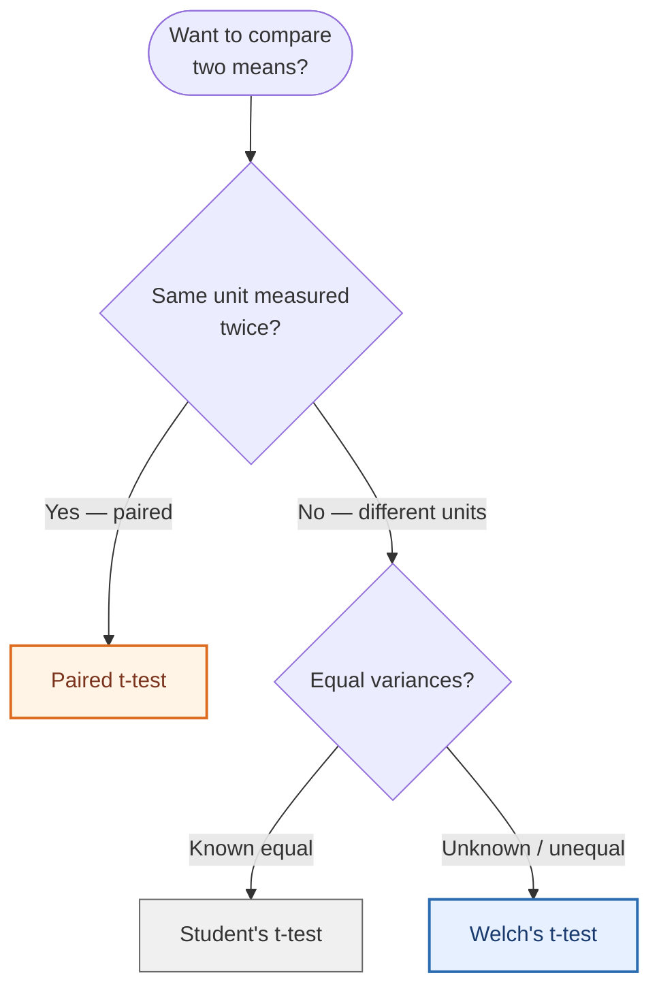

<div align="center">

# Module 4 — Two-Sample and Paired t-Tests

### *Cat Weights and Meditation: When to Use Independent vs. Dependent Samples*

[](#)
[](#)
[](#)
[](#)

</div>

---

> [!NOTE]
> **Module 4 sharpens the distinction between independent and dependent
> samples** — the single most common test-selection mistake in applied
> statistics. Part 1 uses Welch's two-sample t-test on the classic cats
> dataset; Part 2 uses a paired t-test on before/after sleep scores. Each
> part demonstrates a different test, full assumption checking, and rigorous
> interpretation.

---

## Table of Contents

1. [Introduction](#1-introduction)
2. [Part 1 — Cat Bodyweight (Welch's Two-Sample t-Test)](#2-part-1--cat-bodyweight-welchs-two-sample-t-test)
3. [Part 2 — Sleep Quality (Paired-Samples t-Test)](#3-part-2--sleep-quality-paired-samples-t-test)
4. [Decision Framework: Which t-Test?](#4-decision-framework-which-t-test)
5. [R Script](#5-r-script)
6. [References](#6-references)

---

## 1. Introduction

The t-test family is the workhorse of applied statistics — but choosing the
*wrong* variant is one of the most common errors in published research. This
module covers two variants:

| Variant | When to Use | This Module's Demo |
|:--------|:------------|:-------------------|
| **Welch's two-sample t-test** | Two independent groups, unknown/unequal variances | Male vs. Female cat bodyweight |
| **Paired-samples t-test** | Two related measurements on the same units | Sleep score before vs. after meditation |

> [!IMPORTANT]
> The MASS package — required for Part 1 — contains the historic `cats`
> dataset originally analyzed by R. A. Fisher in 1947 for *digitalis*
> experiments. The data has 144 adult cats (>2 kg): 47 female + 97 male,
> with measurements of body weight (kg) and heart weight (g).

---

## 2. Part 1 — Cat Bodyweight (Welch's Two-Sample t-Test)

### 2.1 Research Question

> *Do male and female cat samples have the same bodyweight (`Bwt`)?*

### 2.2 Why Welch's t-Test?

Two key features of the data drive the test choice:

| Feature | Implication |
|:--------|:------------|
| Male and female cats are **separate animals** | Independent samples — not paired |
| No prior knowledge variances are equal | Welch's adjustment beats Student's |
| Sample sizes are unequal (n_M = 97, n_F = 47) | Welch's handles unequal n gracefully |

**Welch's t-test** (`var.equal = FALSE`) does not assume equal variances. It
adjusts the degrees of freedom (Satterthwaite approximation) so the test
remains valid even when variances differ. It is the **default in R's
`t.test()`** for good reason — Student's t-test is brittle when variances
differ, while Welch's loses very little power when they happen to be equal.

> [!TIP]
> **Modern recommendation (Delacre, Lakens, Leys 2017):** always use Welch's
> t-test by default unless you have *strong* prior evidence that variances
> are equal. The cost of being wrong about equal variance is far greater
> than the minor efficiency loss from Welch's when they actually are equal.

### 2.3 Hypotheses (Two-Tailed)

- **H₀:** μ_male = μ_female (no difference in mean bodyweight)
- **Hₐ:** μ_male ≠ μ_female (significant difference exists)

Significance level: **α = 0.05**.

### 2.4 R Code

```r
library(MASS)
data(cats)

male_bwt   <- subset(cats, subset = (cats$Sex == "M"))$Bwt
female_bwt <- subset(cats, subset = (cats$Sex == "F"))$Bwt

bwt_test <- t.test(male_bwt, female_bwt, var.equal = FALSE)
print(bwt_test)
```

### 2.5 Statistical Output

```
        Welch Two Sample t-test

data:  male_bwt and female_bwt
t = 8.7095, df = 136.84, p-value = 8.831e-15
alternative hypothesis: true difference in means is not equal to 0
95 percent confidence interval:
 0.4177242  0.6631268
sample estimates:
mean of x   mean of y
 2.900000   2.359574
```

### 2.6 Visualizations & Assumption Checks

#### Figure 1 — Boxplot Comparison


The boxplot tells the story instantly: the **median male bodyweight is
clearly higher**, and the entire male interquartile range sits above the
female median. The male distribution also shows greater spread — a hint
that variances may indeed differ.

#### Figure 2 — Normality Check via Q-Q Plots


For both sexes, the data points fall **approximately along the diagonal
reference line**, indicating reasonable normality. There's slight stair-stepping
because bodyweight is recorded to 0.1 kg precision (creating ties at common
values like 2.3 kg). With n_F = 47 and n_M = 97, the t-test is robust to
this small deviation.

#### Figure 3 — Density Overlay (Bonus)


Plotting the two density curves on the same axes shows the **separation of
centers** alongside the **overlap in the tails**. The dashed lines mark the
two means — visually about 0.54 kg apart, matching the t-test estimate.

### 2.7 Findings

**P-value analysis:**

> [!TIP]
> **p = 8.831 × 10⁻¹⁵** — extraordinarily small (≪ α = 0.05). We **reject H₀**.

| Quantity | Value | Interpretation |
|:---------|:------|:---------------|
| Mean male Bwt | 2.90 kg | Heavier on average |
| Mean female Bwt | 2.36 kg | Lighter on average |
| Mean difference | +0.54 kg | Males ~23% heavier |
| 95% CI for difference | [0.42, 0.66] kg | Does not contain 0 → confirms significance |
| p-value | 8.831e-15 | Probability of seeing this by chance if H₀ were true |

**Conclusion:** There is **statistically significant evidence** that male
and female cats differ in bodyweight, with males averaging 0.54 kg more.
The 95% confidence interval ranges from 0.42 to 0.66 kg — narrow and entirely
positive, strengthening the conclusion.

---

## 3. Part 2 — Sleep Quality (Paired-Samples t-Test)

### 3.1 Research Question

> *To evaluate whether meditation has an effect on sleep quality, 10 students
> were recruited for a meditation workshop. Sleep quality was measured (0–10,
> higher is better) the week before and the week after the workshop. Does
> meditation improve sleeping quality?*

### 3.2 The Data

| Student | Before | After | Δ (After − Before) |
|:-------:|:------:|:-----:|:------------------:|
| 1 | 4.6 | 6.6 | +2.0 |
| 2 | 7.8 | 7.7 | −0.1 |
| 3 | 9.1 | 9.0 | −0.1 |
| 4 | 5.6 | 6.2 | +0.6 |
| 5 | 6.9 | 7.8 | +0.9 |
| 6 | 8.5 | 8.3 | −0.2 |
| 7 | 5.3 | 5.9 | +0.6 |
| 8 | 7.1 | 6.5 | −0.6 |
| 9 | 3.2 | 5.8 | +2.6 |
| 10 | 4.4 | 4.9 | +0.5 |
| **Mean** | **6.25** | **6.87** | **+0.62** |

### 3.3 Why a Paired t-Test?

> [!CAUTION]
> **An independent-samples t-test would be wrong here.** Each "after" score
> is linked to a specific "before" score from the *same* student. Treating
> the 20 observations as independent inflates the error term by ignoring
> the natural within-student correlation.

The paired t-test:

1. Computes the difference `d_i = After_i − Before_i` for each student
2. Tests whether the mean difference `μ_d` differs from zero
3. **Controls for between-student variation** (some students sleep better
   regardless of meditation) by analyzing only the *change*

This makes the test substantially more powerful for the same sample size.

### 3.4 Hypotheses (One-Tailed, Directional)

The claim is directional ("meditation improves sleep"), so we test
upward only:

- **H₀:** μ_d ≤ 0 (no improvement or worsening)
- **Hₐ:** μ_d > 0 (meditation improves sleep)

### 3.5 R Code

```r
before_scores <- c(4.6, 7.8, 9.1, 5.6, 6.9, 8.5, 5.3, 7.1, 3.2, 4.4)
after_scores  <- c(6.6, 7.7, 9.0, 6.2, 7.8, 8.3, 5.9, 6.5, 5.8, 4.9)

sleep_test <- t.test(after_scores, before_scores,
                     paired = TRUE, alternative = "greater")
print(sleep_test)
```

### 3.6 Statistical Output

```
        Paired t-test

data:  after_scores and before_scores
t = 1.9481, df = 9, p-value = 0.04161
alternative hypothesis: true mean difference is greater than 0
95 percent confidence interval:
 0.03659503        Inf
sample estimates:
mean difference
           0.62
```

### 3.7 Visualizations

#### Figure 4 — Boxplot of Differences


The **median difference is positive**, and the entire IQR sits above the red
"no change" line at zero. The right whisker stretches to ~2.6 (Student 9's
huge gain). The boxplot confirms that most students improved.

#### Figure 5 — Paired Line Plot (Individual Trajectories)


The paired line plot tracks each student's change. **Six students show
upward green lines** (improvement), **four show downward red lines** (slight
decrease). The thick navy line connects the group means: 6.25 → 6.87,
a +0.62 increase.

> [!NOTE]
> The two largest improvements (Students 1 and 9) had the *lowest* baseline
> scores. This is consistent with a **regression-to-the-mean** caveat —
> some of the gain may simply reflect Students 1 and 9 having had unusually
> bad sleep that one week, with natural recovery confounded with meditation
> effect.

#### Figure 6 — Bar Chart of Individual Deltas


The bar chart makes the magnitude and direction of each student's response
unmistakable. The dashed line shows the group mean Δ = +0.62.

### 3.8 Findings at α = 0.05

| Step | Value |
|:-----|:------|
| Observed t | 1.9481 |
| Degrees of freedom | 9 (n − 1) |
| p-value | 0.0416 |
| Mean improvement | +0.62 points on 10-point scale |
| Decision at α = 0.05 | **Reject H₀** |

> [!TIP]
> **Interpretation:** At the 5% significance level, there is statistically
> significant evidence that meditation improves sleep quality. The mean
> improvement of **0.62 points** (a ~10% rise on the scale) is unlikely
> to have occurred by chance alone.

### 3.9 Does the Conclusion Change at α = 0.10?

| α | p-value | Decision | Conclusion |
|:-:|:-------:|:--------:|:-----------|
| 0.05 | 0.0416 | **Reject H₀** | Significant improvement |
| 0.10 | 0.0416 | **Reject H₀** | Still significant; **stronger** evidence relative to threshold |

> [!IMPORTANT]
> The conclusion **does not change** when α increases from 0.05 to 0.10.
> The p-value of 0.0416 is well below both thresholds. In fact, evidence
> against H₀ is *more* compelling against the higher threshold — the test
> would also reject at α = 0.05 with margin to spare.

---

## 4. Decision Framework: Which t-Test?



| Test | Function call | When |
|:-----|:--------------|:-----|
| **Paired** | `t.test(x, y, paired = TRUE)` | Each value in x is meaningfully linked to a specific value in y |
| **Welch's** | `t.test(x, y, var.equal = FALSE)` | Independent groups; equal-variance assumption suspect |
| **Student's** | `t.test(x, y, var.equal = TRUE)` | Independent groups; equal-variance assumption confirmed |

> [!CAUTION]
> **Common mistakes:**
> - Using independent-samples t-test on before/after data → underpowers the test
> - Using paired t-test on truly independent groups → impossible (different n's)
> - Using Student's t-test when variances differ wildly → inflated Type I error

---

## 5. R Script

```r
library(MASS); library(ggplot2)

cat("\n========== PART 1: Cats Dataset T-Test ==========\n")
data(cats)

male_bwt   <- subset(cats, subset = (cats$Sex == "M"))$Bwt
female_bwt <- subset(cats, subset = (cats$Sex == "F"))$Bwt

# Boxplot
boxplot(Bwt ~ Sex, data = cats,
        main = "Comparison of Body Weight between Male and Female Cats",
        xlab = "Sex", ylab = "Body Weight (kg)",
        col = c("pink", "lightblue"),
        names = c("Female", "Male"))

# Welch's t-test
bwt_test <- t.test(male_bwt, female_bwt, var.equal = FALSE)
print(bwt_test)

# Q-Q plots — normality check
par(mfrow = c(1, 2))
qqnorm(female_bwt, main = "Q-Q Plot: Female Cat Bwt"); qqline(female_bwt)
qqnorm(male_bwt,   main = "Q-Q Plot: Male Cat Bwt");   qqline(male_bwt)
par(mfrow = c(1, 1))

cat("\n========== PART 2: Sleep Quality Paired T-Test ==========\n")
before_scores <- c(4.6, 7.8, 9.1, 5.6, 6.9, 8.5, 5.3, 7.1, 3.2, 4.4)
after_scores  <- c(6.6, 7.7, 9.0, 6.2, 7.8, 8.3, 5.9, 6.5, 5.8, 4.9)

sleep_test <- t.test(after_scores, before_scores,
                     paired = TRUE, alternative = "greater")
print(sleep_test)

# Boxplot of differences
score_differences <- after_scores - before_scores
boxplot(score_differences,
        main = "Distribution of Sleep Quality Improvement (After - Before)",
        ylab = "Difference in Sleep Score",
        col = "lightgreen", horizontal = TRUE)
abline(v = 0, col = "red", lty = 2)

# Paired line plot via ggplot2
student_id <- 1:10
sleep_data <- data.frame(
  ID    = rep(student_id, 2),
  Time  = factor(rep(c("Before", "After"), each = 10),
                 levels = c("Before", "After")),
  Score = c(before_scores, after_scores)
)
sleep_data$Student <- paste("Student", sleep_data$ID)

ggplot(sleep_data, aes(x = Time, y = Score, group = ID)) +
  geom_line(aes(color = Student)) +
  geom_point(size = 3, aes(color = Student)) +
  labs(title = "Individual Sleep Quality Scores Before and After Meditation",
       x = "Time of Measurement",
       y = "Sleep Quality Score (0–10)") +
  theme_minimal() + theme(legend.title = element_blank())
```

---

## 6. References

- Venables, W. N., & Ripley, B. D. (2002). *Modern applied statistics with S* (4th ed.). Springer. *(MASS::cats dataset)*
- Fisher, R. A. (1947). The analysis of covariance method for the relation between a part and the whole. *Biometrics, 3*, 65–68. *(original cats data)*
- Delacre, M., Lakens, D., & Leys, C. (2017). Why psychologists should by default use Welch's t-test instead of Student's t-test. *International Review of Social Psychology, 30*(1), 92–101. https://doi.org/10.5334/irsp.82
- Welch, B. L. (1947). The generalization of "Student's" problem when several different population variances are involved. *Biometrika, 34*, 28–35.
- Wickham, H. (2016). *ggplot2: Elegant graphics for data analysis*. Springer.

---

<div align="center">

[← Module 3](Module3_HypothesisTesting.md) &nbsp;•&nbsp; [Back to Portfolio](README.md) &nbsp;•&nbsp; [Next: Module 5 →](Module5_CorrelationRegression.md)

</div>
