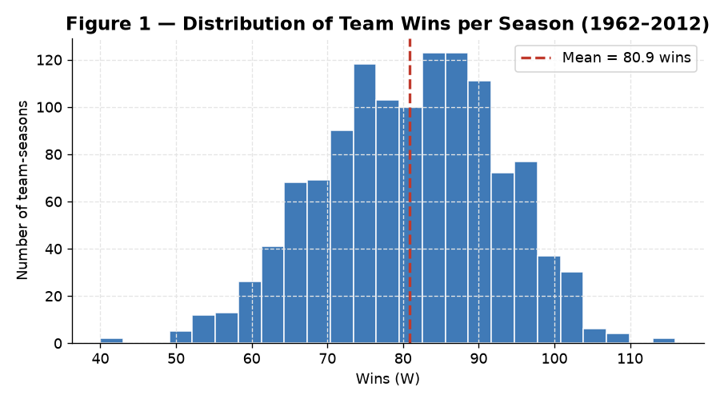
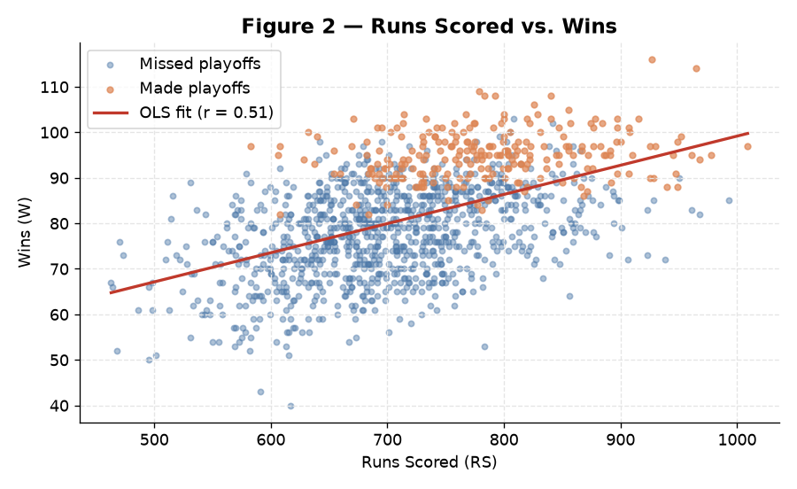
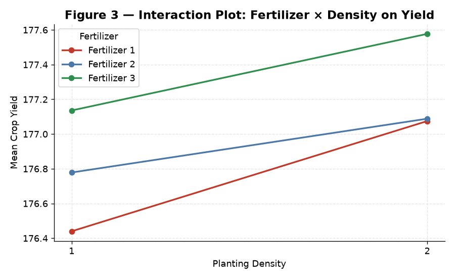
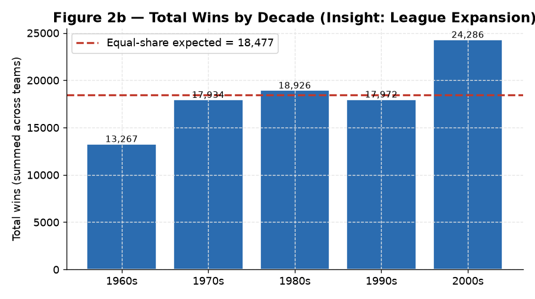
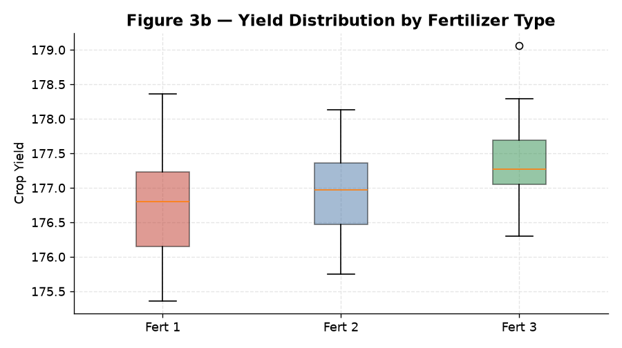

<div align="center">

# Module 2 — Chi-Square & ANOVA

### *Hypothesis Testing for Categorical and Continuous Data: Goodness-of-Fit, Independence, and One- & Two-Way ANOVA — Applied to Textbook Problems, MLB Team Data, and an Agricultural Yield Experiment*

[](#)
[](#)
[](#)
[](#)

</div>

---

> [!NOTE]
> **Module 2 is about choosing and running the right hypothesis test.**
> The **Chi-Square** test handles *categorical* data — does an observed
> distribution match an expectation (goodness-of-fit), and are two categorical
> variables associated (independence)? **ANOVA** handles *continuous* outcomes —
> do three or more group means differ (one-way), and do two factors and their
> interaction matter (two-way)? Every test here follows the same disciplined
> **five-step method**.

---

## Table of Contents

1. [Introduction](#1-introduction)
2. [The Five-Step Method](#2-the-five-step-method)
3. [Part A — Chi-Square Goodness-of-Fit](#3-part-a--chi-square-goodness-of-fit)
4. [Part B — Chi-Square Test of Independence](#4-part-b--chi-square-test-of-independence)
5. [Part C — One-Way ANOVA](#5-part-c--one-way-anova)
6. [Part D — Two-Way ANOVA](#6-part-d--two-way-anova)
7. [Part E — Baseball Dataset Analysis](#7-part-e--baseball-dataset-analysis)
8. [Part F — Crop Yield Analysis](#8-part-f--crop-yield-analysis)
9. [Analytical Insights](#9-analytical-insights)
10. [Conclusion](#10-conclusion)
11. [R Script](#11-r-script)
12. [References](#12-references)

---

## 1. Introduction

Inferential statistics provide the formal framework for drawing conclusions from
data while quantifying uncertainty. This module applies two workhorse methods:

- **Chi-Square (χ²)** — a *non-parametric* test for categorical data, in two forms:
  *goodness-of-fit* (observed vs. theoretical distribution) and *test of
  independence* (association between two categorical variables).
- **ANOVA** — a *parametric* test comparing means of three or more groups;
  *one-way* for a single factor, *two-way* for two factors plus their interaction.

The work spans eight textbook problems and two applied datasets — MLB team
statistics (`baseball.csv`) and an agricultural experiment (`crop_data.csv`).

## 2. The Five-Step Method

Every test below follows the classical procedure:

| Step | Action |
|:----:|:-------|
| **a** | State the null (H₀) and alternative (H₁) hypotheses |
| **b** | Find the **critical value** at the chosen significance level α |
| **c** | Compute the **test statistic** (χ² or F) |
| **d** | **Decision** — reject H₀ if the test statistic exceeds the critical value |
| **e** | **Summarize** the result in the context of the problem |

---

## 3. Part A — Chi-Square Goodness-of-Fit

Tests whether an observed frequency distribution matches an expected theoretical one.

### Problem 11-1.6 — Blood Types (α = 0.10)

- **H₀:** Hospital blood-type distribution = general population. **H₁:** They differ *(claim)*.
- **Critical value** (df = 3): **6.251** &nbsp;|&nbsp; **Test value:** **5.471**

> [!IMPORTANT]
> **Decision — Fail to reject H₀** (5.471 < 6.251). There is not enough evidence
> at α = 0.10 that the hospital's blood-type distribution differs from the
> general population. *A reminder that not every observed difference is
> statistically meaningful.*

### Problem 11-1.8 — Airline On-Time Performance (α = 0.05)

- **H₀:** Airline's on-time distribution = national statistics. **H₁:** They differ *(claim)*.
- **Critical value** (df = 3): **7.815** &nbsp;|&nbsp; **Test value:** **17.832**

> [!IMPORTANT]
> **Decision — Reject H₀** (17.832 > 7.815). The airline's record differs
> significantly from national figures — specifically, fewer on-time arrivals and
> more weather-related delays than expected.

---

## 4. Part B — Chi-Square Test of Independence

Tests whether two categorical variables are associated.

### Problem 11-2.8 — Ethnicity and Movie Admissions (α = 0.05)

- **H₀:** Attendance-by-year is independent of ethnicity. **H₁:** Dependent *(claim)*.
- **Critical value** (df = 3): **7.815** &nbsp;|&nbsp; **Test value:** **60.144** → **Reject H₀**

Strong evidence that a relationship exists between ethnicity and movie attendance across 2013 vs. 2014.

### Problem 11-2.10 — Women in the Military (α = 0.05)

- **H₀:** Rank is independent of branch. **H₁:** A relationship exists *(claim)*.
- **Critical value** (df = 3): **7.815** &nbsp;|&nbsp; **Test value:** **654.27** → **Reject H₀** (emphatically)

Very strong evidence that the officer-to-enlisted proportion is *not* the same across the Army, Navy, Marine Corps, and Air Force.

---

## 5. Part C — One-Way ANOVA

Compares the means of three or more groups on a single factor.

### Problem 12-1.8 — Sodium Content of Foods (α = 0.05)

- **H₀:** μ_condiments = μ_cereals = μ_desserts. **H₁:** At least one mean differs *(claim)*.
- **Critical value** (df = 2, 19): **3.52** &nbsp;|&nbsp; **Test value:** **F = 2.446**

> [!IMPORTANT]
> **Decision — Fail to reject H₀** (2.446 < 3.52). No significant difference in
> mean sodium across condiments, cereals, and desserts on this sample.

Two further one-way models are in the script — **Sales by company type** (12-2.10)
and **Per-pupil expenditures by region** (12-2.12) — both likewise **non-significant**.

---

## 6. Part D — Two-Way ANOVA

Examines two factors and their interaction on a continuous outcome.

### Problem 12-3.10 — Increasing Plant Growth (Light × Food, α = 0.05)

Three hypotheses: main effect of **light**, main effect of **food**, and their **interaction**.
Critical F (df = 1, 8) = **5.32**.

| Effect | F-statistic | Decision |
|:-------|:-----------:|:---------|
| Grow-light strength | 3.681 | Fail to reject |
| **Plant food type** | **24.562** | **Reject H₀** ✓ |
| Light × Food interaction | 1.438 | Fail to reject |

**Only plant food** significantly affects growth; light strength and the interaction do not.

---

## 7. Part E — Baseball Dataset Analysis

`baseball.csv` holds **1,232 team-seasons from 1962–2012** (15 variables: runs
scored/allowed, wins, OBP, SLG, BA, playoff flags, and more).

### Figure 1 — Distribution of Team Wins



Wins are approximately **normal, centered on ~81** — exactly half of a 162-game
season, as expected in a zero-sum league where every win is another team's loss.

### Figure 2 — Runs Scored vs. Wins



A clear **positive linear relationship** (r ≈ 0.51): teams that score more runs
win more games. The playoff coloring (added here) shows the practical payoff —
playoff teams (orange) cluster in the upper-right high-run, high-win region.

### Chi-Square Goodness-of-Fit — Wins Across Decades (α = 0.05)

- **H₀:** Wins are equally distributed across the five decades. **H₁:** They are not *(claim)*.
- **Critical value** (df = 4): **9.488** &nbsp;|&nbsp; **Test value:** **χ² = 3,336** (p < .001) → **Reject H₀**

---

## 8. Part F — Crop Yield Analysis

`crop_data.csv` is a designed experiment: **3 fertilizers × 2 planting densities ×
4 blocks**, 96 yield observations. A two-way ANOVA (with block) was fitted.

### Figure 3 — Interaction Plot



| Effect | F | p-value | Significant? |
|:-------|:---:|:-------:|:------------:|
| **Fertilizer** | F(2, 88) = 8.944 | < .001 | ✓ Yes |
| **Density** | F(1, 88) = 15.099 | < .001 | ✓ Yes |
| Fertilizer × Density | F(2, 88) = 0.631 | .535 | ✗ No |

> [!TIP]
> Both fertilizer and density significantly affect yield, but the **interaction is
> not significant** — the lines in Figure 3 are **nearly parallel**. This means a
> fertilizer's advantage is *consistent* across both densities; the two factors
> act **independently** and can be optimized separately.

---

## 9. Analytical Insights

> [!NOTE]
> This section goes beyond the graded report — additional visual and quantitative
> findings computed directly from the two datasets.

### Insight 1 — The χ² = 3,336 is really an *expansion* story

The decade goodness-of-fit test rejects H₀ overwhelmingly, but the *reason* is
structural, not competitive. Total league wins per decade have climbed steadily:



| Decade | Total wins | vs. equal-share expectation |
|:-------|:----------:|:---------------------------:|
| 1960s | 13,267 | well below |
| 1970s | 17,934 | below |
| 1980s | 18,926 | near |
| 1990s | 17,972 | near |
| 2000s | 24,286 | far above |

Because MLB **added teams** over these decades (expansion from ~20 to 30
franchises), more games are played and more total wins accumulate. The χ² test
correctly detects that wins are *not* uniform across decades — but the driver is
the growing number of teams, not a change in competitive balance. **A significant
test still needs a causal story to be meaningful.**

### Insight 2 — Fertilizer 3 dominates, additively

Cell means confirm the parallel-lines reading of Figure 3: Fertilizer 3 yields
the most at *both* densities, and density 2 beats density 1 for *every*
fertilizer. The effects simply add up.



| | Fertilizer 1 | Fertilizer 2 | Fertilizer 3 |
|:--|:---:|:---:|:---:|
| **Density 1** | 176.44 | 176.78 | 177.14 |
| **Density 2** | 177.07 | 177.09 | 177.58 |

Grand mean ≈ **177.0**. The practical recommendation is unambiguous: **Fertilizer 3
at the higher planting density** maximizes yield, and because there's no
interaction, that choice holds regardless of the other factor.

### Insight 3 — Parametric vs. non-parametric, matched to the data

This module is a compact tour of *test selection*. The table below is the decision
map the eight problems collectively illustrate:

| If the outcome is… | …and you're asking… | Use |
|:-------------------|:--------------------|:----|
| Categorical (counts) | Does it match an expected distribution? | χ² goodness-of-fit |
| Categorical × categorical | Are the two variables associated? | χ² test of independence |
| Continuous, 1 factor (3+ groups) | Do the group means differ? | One-way ANOVA |
| Continuous, 2 factors | Do both factors / their interaction matter? | Two-way ANOVA |

---

## 10. Conclusion

Across eight textbook problems and two datasets, the disciplined five-step method
consistently separated signal from noise. Chi-Square analyses surfaced genuine
associations (military rank × branch, ethnicity × movie attendance) and confirmed
distributional departures (airline performance), while also correctly showing that
some differences — blood types — are not significant. ANOVA found that most
one-way comparisons (sodium, sales, expenditures) lacked significant mean
differences, while the two-way models isolated the factors that truly mattered:
plant food for growth, and both fertilizer and density (independently) for crop
yield.

> [!IMPORTANT]
> **Key takeaway:** a structured hypothesis-testing framework — comparing a test
> statistic to a critical value, or a p-value to α — replaces intuition with an
> objective basis for decisions. Paired with clear visualizations, it turns raw
> data into defensible, communicable conclusions.

---

## 11. R Script

The complete, runnable script is in [`R Script.R`](R%20Script.R). Representative excerpts:

```r
# Chi-Square goodness-of-fit (Blood Types)
observed_blood <- c(12, 8, 24, 6)
probs_blood    <- c(0.20, 0.28, 0.36, 0.16)
chisq.test(observed_blood, p = probs_blood)
qchisq(1 - 0.10, df = 3)            # critical value

# Chi-Square test of independence (Women in the Military)
military_data <- matrix(c(10791, 7816,  932, 11819,
                          62491, 42750, 9525, 54344), nrow = 2, byrow = TRUE)
chisq.test(military_data)

# Two-way ANOVA (Plant Growth)
plant_aov <- aov(growth ~ light * food, data = plant_df)
summary(plant_aov)

# Baseball: wins across decades
bb$Decade <- bb$Year - (bb$Year %% 10)
wins <- bb %>% filter(Decade >= 1960 & Decade <= 2000) %>%
  group_by(Decade) %>% summarize(total_wins = sum(W))
chisq.test(wins$total_wins)

# Crop yield: two-way ANOVA with block
crop_aov <- aov(yield ~ fertilizer * density + block, data = crop)
summary(crop_aov)
interaction.plot(crop$density, crop$fertilizer, crop$yield, fun = mean, type = "b")
```

> [!NOTE]
> The figures in this README were rendered from `baseball.csv` and `crop_data.csv`
> to reproduce and extend the report's Figures 1–3. The original R analysis uses
> base-R `hist()`, `plot()`, and `interaction.plot()`.

---

## 12. References

- Bluman, A. G. (2018). *Elementary Statistics: A Step by Step Approach* (10th ed.). McGraw-Hill. *(source of Chapter 11–12 problems)*
- Motion Picture Association of America. (2014). *Theatrical Market Statistics*.
- U.S. Department of Transportation. (n.d.). *Bureau of Transportation Statistics*. https://www.transtats.bts.gov
- R Core Team. (2023). *R: A Language and Environment for Statistical Computing*. R Foundation for Statistical Computing. https://www.R-project.org/
- Wickham, H., et al. (2019). Welcome to the tidyverse. *Journal of Open Source Software, 4*(43), 1686. *(dplyr)*

---

<div align="center">

**Sri Ram Prabu E** &nbsp;•&nbsp; ALY6015: Intermediate Analytics &nbsp;•&nbsp; Dr. Paul Dooley &nbsp;•&nbsp; 09/28/2025

[Back to Portfolio](../README.md) &nbsp;•&nbsp; [Full Report (PDF)](Chi%20Square%20and%20ANOVA%20-%20Report.pdf) &nbsp;•&nbsp; [Assignment Brief](Assignment%20Brief%20with%20Rubric.pdf)

</div>
