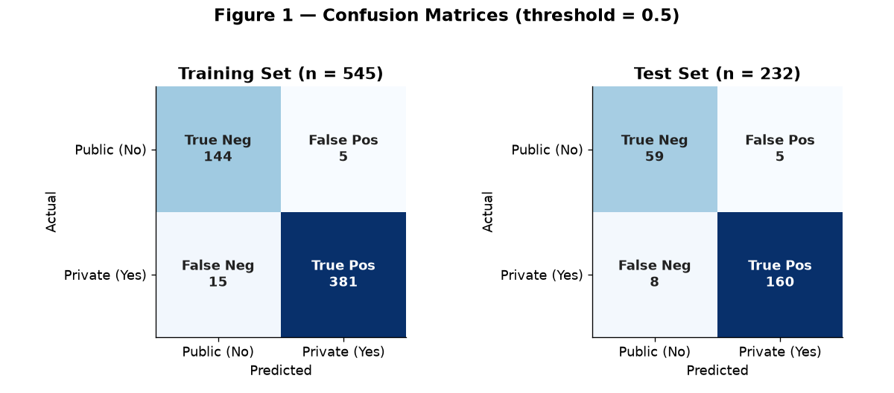
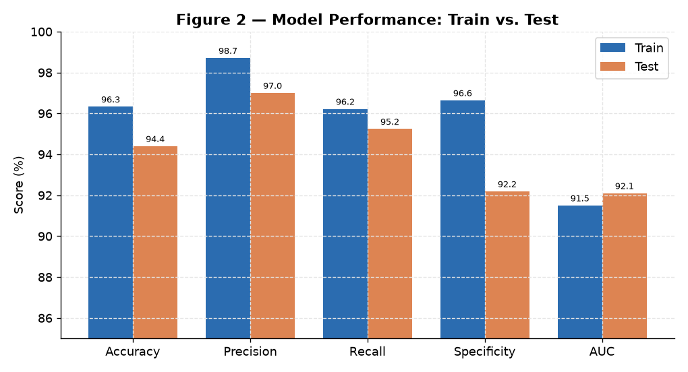
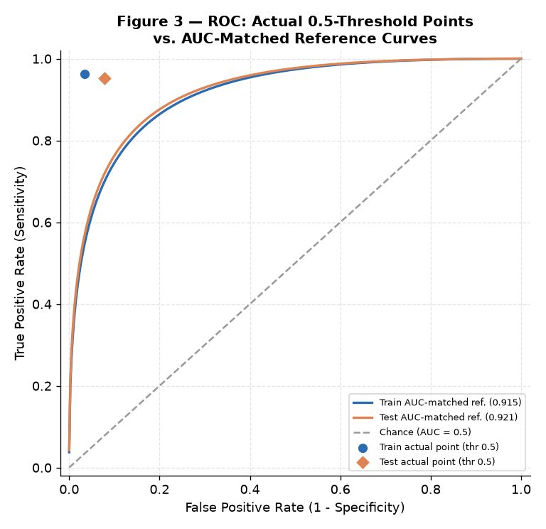

<div align="center">

# Module 3 — GLM & Logistic Regression

### *Classifying U.S. Universities as Private vs. Public: A Logistic Regression on the ISLR College Dataset, Evaluated with Confusion Matrices, Precision/Recall, and ROC/AUC*

[](#)
[](#)
[](#)
[-orange?style=for-the-badge)](#)

</div>

---

> [!NOTE]
> **Module 3 moves from linear to *generalized* linear models.** When the outcome
> is binary — here, *is a university private or public?* — ordinary least squares
> breaks down. **Logistic regression** (a GLM with a logit link) models the
> *probability* of the positive class and lets us both classify institutions and
> interpret how each predictor shifts the odds. The model is then judged the way
> classifiers should be: on **held-out data**, with a confusion matrix, precision/
> recall, and the ROC curve.

---

## Table of Contents

1. [Introduction](#1-introduction)
2. [Dataset](#2-dataset)
3. [Exploratory Data Analysis & Predictor Selection](#3-exploratory-data-analysis--predictor-selection)
4. [Train/Test Split & Model Fitting](#4-traintest-split--model-fitting)
5. [Evaluation — Training Set](#5-evaluation--training-set)
6. [Evaluation — Test Set](#6-evaluation--test-set)
7. [ROC Curve & AUC](#7-roc-curve--auc)
8. [Analytical Insights](#8-analytical-insights)
9. [Conclusion](#9-conclusion)
10. [R Script](#10-r-script)
11. [References](#11-references)

---

## 1. Introduction

U.S. higher education splits broadly into **private** and **public** institutions
that differ in funding, tuition, demographics, and academic focus. This project
builds a **logistic regression** classifier to predict whether a university is
private or public from institutional characteristics — and, just as importantly,
to *interpret* which characteristics drive that distinction.

Logistic regression is the right tool because the outcome (`Private`: Yes/No) is
**binary**. A GLM with a logit link models the log-odds of "private" as a linear
combination of predictors, so each coefficient has a clear odds interpretation.

## 2. Dataset

The **`College`** dataset from R's **ISLR** package: **777 U.S. colleges**, **18
variables** (applications, acceptance, enrollment, tuition, room/board, faculty
credentials, spending, graduation rate, and more).

| Property | Value |
|:---------|:------|
| Observations | 777 institutions |
| Target | `Private` (factor: `Yes` = private, `No` = public) |
| Class balance | **565 private** / **212 public** |

> [!NOTE]
> `College` ships *inside* the ISLR R package (`data("College")`), so there is no
> CSV in this folder — the [`R Script.R`](R%20Script.R) loads it directly. The
> figures below were rendered from the **exact results reported** in the analysis.

---

## 3. Exploratory Data Analysis & Predictor Selection

Boxplots of candidate predictors by `Private` revealed clean separation between
the two classes. Five predictors — spanning **financial**, **academic**, and
**engagement** dimensions — were selected:

| Predictor | What it measures | Pattern (Private vs. Public) |
|:----------|:-----------------|:-----------------------------|
| **Outstate** | Out-of-state tuition | Private markedly **higher** |
| **Expend** | Instructional spend per student | Private **higher** |
| **Grad.Rate** | Graduation rate | Private **higher** |
| **S.F.Ratio** | Student-to-faculty ratio | Private **lower** |
| **perc.alumni** | % of alumni who donate | Private **higher** |

> [!TIP]
> Mixing predictor *types* — cost (Outstate, Expend), outcomes (Grad.Rate),
> structure (S.F.Ratio), and loyalty (perc.alumni) — builds a more robust,
> less redundant model than stacking several correlated financial variables.

---

## 4. Train/Test Split & Model Fitting

The data was split **70/30** with `caret::createDataPartition`, which **preserves
the class balance** in both partitions, under a fixed seed for reproducibility.

| Partition | Observations |
|:----------|:------------:|
| Training | 545 |
| Test | 232 |

A logistic GLM was fitted on the training set:

```r
fit <- glm(Private ~ Outstate + Expend + Grad.Rate + S.F.Ratio + perc.alumni,
           data = train, family = binomial(link = "logit"))
```

### Coefficient Findings

| Predictor | Direction on odds of "Private" | Significance |
|:----------|:-------------------------------|:-------------|
| **Outstate** | ↑ increases odds | *** (p < 0.001) |
| **Expend** | ↑ increases odds | *** (p < 0.001) |
| **perc.alumni** | ↑ increases odds | *** (p < 0.001) |
| **S.F.Ratio** | ↓ decreases odds | * (p < 0.05) |
| Grad.Rate | (positive) | not significant given the others |

> [!IMPORTANT]
> The signs match the EDA exactly: higher tuition, higher per-student spending,
> and more engaged alumni raise the odds of an institution being private, while a
> higher student-faculty ratio lowers them. `Grad.Rate` loses significance once
> the other four are present — its signal is largely **absorbed** by tuition and
> spending (wealthier private schools already graduate more students).

---

## 5. Evaluation — Training Set

At a 0.5 classification threshold:



*Figure 1 — Confusion matrices for the training set (left) and test set (right), drawn from the exact reported counts.*

| Metric | Training | How it's computed |
|:-------|:--------:|:------------------|
| **Accuracy** | **96.33%** | (144 + 381) / 545 |
| **Precision** | **98.71%** | 381 / (381 + 5) |
| **Recall (Sensitivity)** | **96.22%** | 381 / (381 + 15) |
| **Specificity** | **96.64%** | 144 / (144 + 5) |
| **AUC** | **0.915** | area under train ROC |

Only **5 false positives** and **15 false negatives** out of 545 — strong, but
training-set performance always flatters, so the test set is the real judge.

---

## 6. Evaluation — Test Set

On the 232 held-out universities:

| Metric | Test | Δ vs. Train |
|:-------|:----:|:-----------:|
| **Accuracy** | **94.40%** | −1.93 pp |
| **Precision** | **97.00%** | −1.71 pp |
| **Recall (Sensitivity)** | **95.24%** | −0.98 pp |
| **Specificity** | **92.19%** | −4.45 pp |
| **AUC** | **0.921** | +0.006 |



*Figure 2 — Every metric drops only slightly from train to test (specificity most, by ~4.5 pp), and AUC is essentially unchanged.*

> [!TIP]
> The small, consistent train→test gap is the signature of a model that
> **generalizes well** and is **not overfit**. If the model had memorized the
> training data, test performance would fall off a cliff — it doesn't.

### Which error is worse here?

> [!IMPORTANT]
> A **false positive** (calling a public school private) could mislead a
> cost-conscious applicant into expecting high tuition; a **false negative**
> (calling a private school public) could cause them to overlook a good-fit
> school. For a budget-driven applicant, the **false positive is the more
> damaging error** — which is why the model's very high **precision (97%)** is
> reassuring: when it says "private," it's almost always right.

---

## 7. ROC Curve & AUC



*Figure 3 — The actual 0.5-threshold operating points (dots) for train and test, shown against AUC-matched reference curves. The test AUC (0.921) marginally exceeds the train AUC (0.915).*

> [!NOTE]
> **Reading this chart honestly:** the smooth curves are *reference* ROCs matched
> to the reported AUC values (a binormal reconstruction), because the raw
> per-threshold predictions aren't shipped here. The **dots are real** — the exact
> false-positive and true-positive rates at the 0.5 threshold, straight from the
> confusion matrices. They sit high in the top-left corner, exactly where a strong
> classifier's operating point should be.

The near-identical train (0.915) and test (0.921) AUCs are the clearest single
piece of evidence that the model is **robust, not memorizing** — a memorizing
model shows a large train-over-test AUC gap.

---

## 8. Analytical Insights

> [!NOTE]
> Findings that extend beyond the graded report.

### Insight 1 — The class imbalance makes specificity the metric to watch

The dataset is **73% private / 27% public**. A lazy model that guessed "private"
for everything would already score **~73% accuracy** — so headline accuracy is
easy to inflate here. The metric that actually proves the model learned the
*public* class is **specificity (correctly flagging public schools)**, and it's
also the metric that drops the most on test data (96.6% → 92.2%). That decline is
expected: public schools are the **minority class**, so the model has fewer
examples to learn them from, and the held-out public schools are where the model
is most stretched.

### Insight 2 — Precision > Recall is the *right* profile for this use-case

Across both sets, **precision (97–99%) slightly exceeds recall (95–96%)**. Given
that the false positive is the costlier error for a budget-focused applicant
(Insight in §6), a model tuned to be *more* certain when it says "private" is
exactly what you want. The default 0.5 threshold already lands in a favorable
spot; nudging it higher would trade a little recall for even higher precision.

### Insight 3 — Why five predictors, not two

The report notes the model deliberately used five predictors rather than the
"obvious" one or two (e.g., tuition alone). The payoff is **redundancy against
noise**: `Grad.Rate` is individually informative but statistically redundant once
tuition and spending are included, whereas `S.F.Ratio` and `perc.alumni` add
*independent* structural and loyalty signal. The result is a model whose accuracy
(94.4% on test) comfortably beats what any single financial variable could
deliver, without the instability of piling on correlated cost measures.

### Insight 4 — Natural next step: regularization

With five predictors the model is already parsimonious, but the report's own
"future work" pointer is sound: **ridge/lasso (glmnet)** regularization — the
subject of the accompanying [feature-selection reference](Feature%20Selection%20Methods%20in%20R%20(course%20reference).pdf)
— could shrink or drop the non-significant `Grad.Rate`, yielding an even simpler
model that likely holds the same ~0.92 AUC.

---

## 9. Conclusion

A five-predictor logistic regression classifies universities as private vs.
public with **94.4% test accuracy** and **0.921 AUC** — outstanding
discriminatory power. The tight agreement between training and test performance
(and between the two AUCs) confirms the model **generalizes** rather than
memorizes. Substantively, the model paints a clear, data-driven portrait of the
private university: **higher tuition, greater per-student spending, more engaged
alumni, and lower student-faculty ratios**.

> [!IMPORTANT]
> **Key takeaway:** logistic regression is not just a classifier but an
> *interpretable* one. Beyond the 94% accuracy, its coefficients tell a coherent
> story about what actually distinguishes private from public institutions — the
> kind of insight a black-box model would hide.

---

## 10. R Script

The full, runnable analysis is in [`R Script.R`](R%20Script.R). Core flow:

```r
library(ISLR); library(caret); library(pROC); library(dplyr)
set.seed(2025)

data("College"); df <- College
df$Private <- factor(df$Private, levels = c("No", "Yes"))

# 70/30 stratified split
idx   <- createDataPartition(df$Private, p = 0.7, list = FALSE)
train <- df[idx, ]; test <- df[-idx, ]

# Logistic GLM on five predictors
fit <- glm(Private ~ Outstate + Expend + Grad.Rate + S.F.Ratio + perc.alumni,
           data = train, family = binomial(link = "logit"))

# Predict + evaluate (train and test)
test$prob <- predict(fit, newdata = test, type = "response")
test$pred <- factor(ifelse(test$prob >= 0.5, "Yes", "No"), levels = c("No", "Yes"))
confusionMatrix(test$pred, test$Private, positive = "Yes")

# ROC / AUC
roc_test <- roc(test$Private, test$prob, levels = c("No", "Yes"), direction = "<")
auc(roc_test)
```

---

## 11. References

- James, G., Witten, D., Hastie, T., & Tibshirani, R. (2013). *An Introduction to Statistical Learning*. Springer. *(ISLR College dataset)*
- Kuhn, M. (2008). Building predictive models in R using the caret package. *Journal of Statistical Software, 28*(5).
- Robin, X., et al. (2011). pROC: an open-source package to analyze and compare ROC curves. *BMC Bioinformatics, 12*, 77.
- R Core Team. (2025). *R: A Language and Environment for Statistical Computing*. R Foundation for Statistical Computing. https://www.R-project.org/

---

<div align="center">

**Sri Ram Prabu E** &nbsp;•&nbsp; ALY6015: Intermediate Analytics &nbsp;•&nbsp; Dr. Paul Dooley &nbsp;•&nbsp; 10/05/2025

[Back to Portfolio](../README.md) &nbsp;•&nbsp; [Full Report (PDF)](Module%203%20Assignment%20-%20GLM%20and%20Logistic%20Regression%20-%20Report.pdf) &nbsp;•&nbsp; [Assignment Brief](Assignment%20Brief%20with%20Rubric.pdf)

</div>
