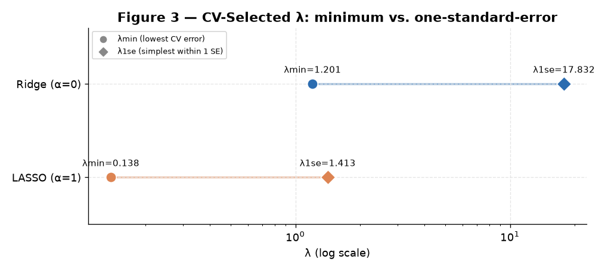
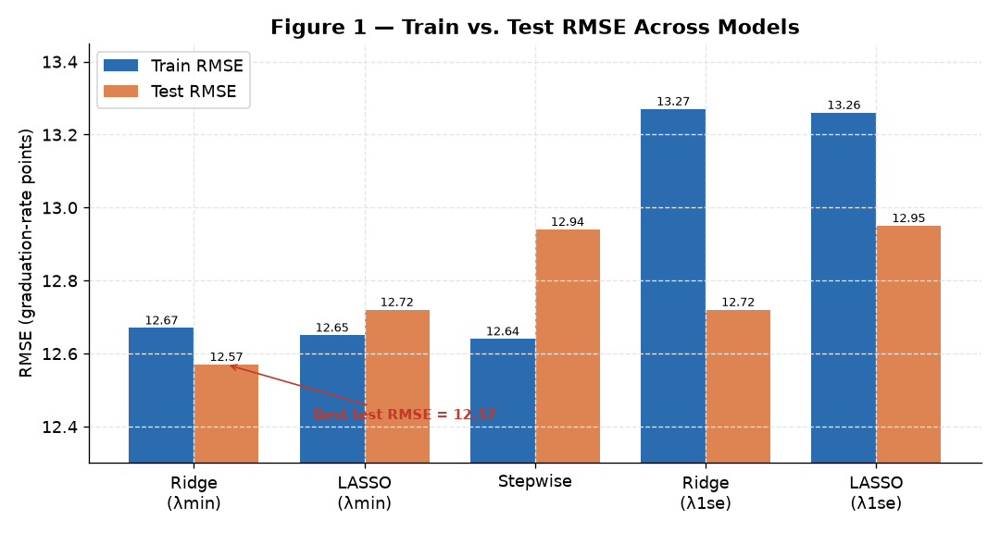
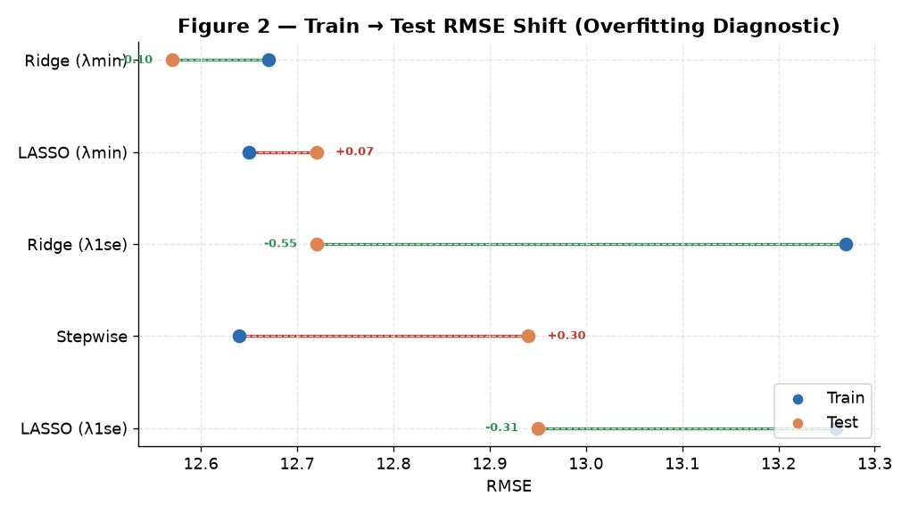

<div align="center">

# Module 4 — Regularization (Ridge & LASSO)

### *Predicting College Graduation Rate with Penalized Regression: Ridge (L2) vs. LASSO (L1) vs. Stepwise, Tuned by 10-Fold Cross-Validation*

[](#)
[](#)
[](#)
[-orange?style=for-the-badge)](#)

</div>

---

> [!NOTE]
> **Module 4 is about paying a penalty to gain generalization.** When predictors
> are numerous and correlated, ordinary least squares overfits — it chases noise.
> **Regularization** adds a penalty on coefficient size: **Ridge (L2)** shrinks
> all coefficients toward zero to tame multicollinearity, while **LASSO (L1)**
> shrinks *and* zeroes some out, doing automatic feature selection. This project
> pits both against a **stepwise** baseline to predict college graduation rates.

---

## Table of Contents

1. [Introduction](#1-introduction)
2. [Data & Methods](#2-data--methods)
3. [Ridge Regression (α = 0)](#3-ridge-regression-α--0)
4. [LASSO Regression (α = 1)](#4-lasso-regression-α--1)
5. [Stepwise Selection Baseline](#5-stepwise-selection-baseline)
6. [Model Comparison](#6-model-comparison)
7. [Analytical Insights](#7-analytical-insights)
8. [Conclusion](#8-conclusion)
9. [R Script](#9-r-script)
10. [References](#10-references)

---

## 1. Introduction

This project asks whether **regularization improves prediction of graduation rate
(`Grad.Rate`)** across U.S. colleges, using the **`College`** dataset from R's
ISLR package. Graduation rate is modeled as a continuous function of institutional
features (enrollment, acceptance metrics, tuition, spending, and more) with two
penalized linear models plus a classic stepwise benchmark.

| Model | Penalty | Behavior |
|:------|:--------|:---------|
| **Ridge** | L2 (sum of squared coefficients) | Shrinks correlated coefficients; keeps all predictors |
| **LASSO** | L1 (sum of absolute coefficients) | Shrinks *and* zeroes out weak predictors (feature selection) |
| **Stepwise** | none (AIC search) | Heuristically adds/drops variables; unpenalized |

## 2. Data & Methods

- **Dataset:** `ISLR::College` — 777 institutions, 18 variables; response = `Grad.Rate`.
- **Pre-processing:** drop missing rows (data was complete); `model.matrix` one-hot
  encodes the `Private` factor; `glmnet`'s internal standardization puts predictors
  on comparable scales.
- **Split:** 70/30 train/test via `caret::createDataPartition`, fixed seed.
- **Tuning:** 10-fold cross-validation (`cv.glmnet`) selects λ. Two λ are recorded —
  **λmin** (lowest CV error) and **λ1se** (simplest model within one standard error).
- **Metric:** RMSE on train and test; the train↔test gap flags overfitting.

> [!NOTE]
> `College` lives inside the ISLR R package (`data("College")`), so there is no CSV
> in this folder — the [`R Script.R`](R%20Script.R) loads it directly. The figures
> below are rendered from the **exact results reported** in the analysis.

### The λmin vs. λ1se Choice



*Figure 3 — Cross-validation selects two λ per model. Note the large Ridge gap (λmin = 1.201 → λ1se = 17.832): a much simpler, more heavily-penalized model performs nearly as well as the best one. LASSO's λ are far smaller (0.138, 1.413), as expected given L1 penalizes on a different scale.*

---

## 3. Ridge Regression (α = 0)

| | Value |
|:--|:--|
| **λmin** | 1.201 |
| **λ1se** | 17.832 |

**Coefficients:** at λmin, every coefficient is shrunk toward zero but **none is
eliminated** — the defining trait of Ridge. This is exactly what you want when
multicollinearity is present: shrink the correlated predictors together rather
than arbitrarily dropping one.

| Model | Train RMSE | Test RMSE |
|:------|:----------:|:---------:|
| **Ridge (λmin)** | 12.67 | **12.57** |
| Ridge (λ1se) | 13.27 | 12.72 |

> [!TIP]
> The λmin model's **test RMSE (12.57) is actually below its train RMSE (12.67)**.
> Unusual, but it can happen on a single split — and it strongly signals the model
> is **not overfit**.

---

## 4. LASSO Regression (α = 1)

| | Value |
|:--|:--|
| **λmin** | 0.138 |
| **λ1se** | 1.413 |

**Coefficients & feature selection:** at λmin, LASSO drives **several coefficients
to exactly zero**, producing a smaller, more interpretable model. That's its
signature advantage over Ridge — but only useful if the discarded predictors truly
add little.

| Model | Train RMSE | Test RMSE |
|:------|:----------:|:---------:|
| LASSO (λmin) | 12.65 | 12.72 |
| LASSO (λ1se) | 13.26 | 12.95 |

The small train↔test gap confirms LASSO is not overfit, and λmin is competitive —
just not the winner here.

---

## 5. Stepwise Selection Baseline

A bidirectional (AIC) stepwise linear model was fitted as an unpenalized benchmark.

**Selected model:**
```
Grad.Rate ~ Private + Apps + Top25perc + F.Undergrad + P.Undergrad +
            Outstate + Room.Board + Personal + perc.alumni + Expend
```

| Train RMSE | Test RMSE |
|:----------:|:---------:|
| **12.64** (lowest train) | 12.94 (weaker test) |

> [!IMPORTANT]
> Stepwise wins on **training** error — expected, since it's unpenalized and free
> to fit the training data as tightly as AIC allows. But it **loses on test**,
> the metric that matters. This is the overfitting trap that regularization is
> designed to avoid.

---

## 6. Model Comparison



*Figure 1 — Train and test RMSE for all five models. Ridge (λmin) achieves the lowest test RMSE.*

| Model | Train RMSE | Test RMSE | Verdict |
|:------|:----------:|:---------:|:--------|
| **Ridge (λmin)** | 12.67 | **12.57** | ✅ Best test performance |
| Ridge (λ1se) | 13.27 | 12.72 | Simpler, competitive |
| LASSO (λmin) | 12.65 | 12.72 | Competitive |
| LASSO (λ1se) | 13.26 | 12.95 | Simpler, slightly weaker |
| Stepwise | 12.64 | 12.94 | Lowest train, weaker test |



*Figure 2 — The train→test shift per model. Green = test error improves over train (robust); red = test error worsens (mild overfitting). Stepwise shows the largest worsening (+0.30); the Ridge models actually improve on test.*

> [!IMPORTANT]
> **Winner: Ridge (λmin), test RMSE = 12.57.** Ridge beats LASSO and Stepwise
> because the College data has **many genuinely-relevant, correlated predictors**.
> Ridge shrinks them together — retaining every predictor's information while
> reducing variance — whereas LASSO and Stepwise *discard* predictors and lose
> signal. The expectation that LASSO would win (via feature selection) was **not**
> borne out: here, keeping and moderating all predictors beats selecting a subset.

---

## 7. Analytical Insights

> [!NOTE]
> Findings that extend beyond the graded report.

### Insight 1 — The RMSE spread is tiny; the *ranking* is the story

Every model lands between **12.57 and 12.95** test RMSE — a spread of under 0.4
graduation-rate points. On raw accuracy, all four approaches are practically
interchangeable. What separates them is **robustness**: Ridge's edge isn't a big
accuracy jump, it's that Ridge *doesn't degrade* out-of-sample while Stepwise does.
For model selection, the consistency matters more than the decimal.

### Insight 2 — Ridge winning is a *diagnosis* of the data

That Ridge beats LASSO is itself informative. LASSO wins when a few strong
predictors dominate and the rest are noise; Ridge wins when **many predictors each
contribute a little** and are **mutually correlated**. Ridge's victory here says
graduation rate is a **diffuse, multi-factor outcome** — selectivity, resources,
tuition, and private status all pulling together — not something reducible to two
or three headline variables.

### Insight 3 — λ1se is the underrated pragmatic choice

The λ1se models trade only a **sliver of test accuracy** (Ridge λ1se: 12.72 vs.
λmin's 12.57) for a **substantially simpler, more heavily-regularized** model. In
a production setting where stability and interpretability matter, λ1se is often the
smarter pick — and Figure 3 shows how much simpler it is (Ridge λ jumps ~15×).

### Insight 4 — Why RMSE ≈ 12.6 is the real ceiling here

All models converge near RMSE ≈ 12.6 because that's roughly the **irreducible
error** for predicting graduation rate from these institutional features alone.
Graduation depends heavily on unobserved factors — student preparation, financial
aid, local economy — that aren't in the dataset. No amount of regularization
recovers signal that was never measured; the value of regularization is getting
*closest to that floor without overfitting*, which Ridge does best.

---

## 8. Conclusion

Regularization proved its worth. **Ridge regression at λmin is the recommended
model**, delivering the best out-of-sample accuracy (test RMSE 12.57) by shrinking
a set of correlated, collectively-informative predictors rather than discarding
any. LASSO and Stepwise were competitive but slightly weaker — both pay for their
feature-selection by shedding useful signal.

> [!IMPORTANT]
> **Key takeaway:** the model with the lowest *training* error (Stepwise) was not
> the best model. Penalizing complexity — deliberately fitting the training data a
> little *worse* — produced better predictions on unseen data. That trade is the
> entire point of regularization, and it beat the heuristic stepwise approach here.

---

## 9. R Script

The full, runnable analysis is in [`R Script.R`](R%20Script.R). Core flow:

```r
library(ISLR); library(caret); library(glmnet); library(dplyr)
set.seed(2025)

data("College")
df <- na.omit(as.data.frame(College))
y  <- df$Grad.Rate
X  <- model.matrix(Grad.Rate ~ ., data = df)[, -1]   # one-hot Private

idx <- createDataPartition(y, p = 0.7, list = FALSE)
X_train <- X[idx, ]; y_train <- y[idx]
X_test  <- X[-idx, ]; y_test <- y[-idx]
rmse <- function(a, p) sqrt(mean((a - p)^2))

# Ridge (alpha = 0) and LASSO (alpha = 1), tuned by 10-fold CV
cv_ridge <- cv.glmnet(X_train, y_train, alpha = 0, nfolds = 10)
cv_lasso <- cv.glmnet(X_train, y_train, alpha = 1, nfolds = 10)

rmse(y_test, predict(cv_ridge, X_test, s = "lambda.min"))   # 12.57 (winner)
rmse(y_test, predict(cv_lasso, X_test, s = "lambda.min"))   # 12.72

# Stepwise baseline (AIC, bidirectional)
step_lm <- step(lm(Grad.Rate ~ ., data = df[idx, ]), direction = "both", trace = 0)
rmse(df[-idx, ]$Grad.Rate, predict(step_lm, df[-idx, ]))    # 12.94
```

---

## 10. References

- James, G., Witten, D., Hastie, T., & Tibshirani, R. (2013). *An Introduction to Statistical Learning*. Springer. *(ISLR College dataset)*
- Friedman, J., Hastie, T., & Tibshirani, R. (2010). Regularization paths for generalized linear models via coordinate descent. *Journal of Statistical Software, 33*(1). *(glmnet)*
- Kuhn, M. (2008). Building predictive models in R using the caret package. *Journal of Statistical Software, 28*(5).
- R Core Team. (2025). *R: A Language and Environment for Statistical Computing*. R Foundation for Statistical Computing. https://www.R-project.org/

---

<div align="center">

**Sri Ram Prabu E** &nbsp;•&nbsp; ALY6015: Intermediate Analytics &nbsp;•&nbsp; Dr. Paul Dooley &nbsp;•&nbsp; 10/12/2025

[Back to Portfolio](../README.md) &nbsp;•&nbsp; [Full Report (PDF)](Module%204%20Assignment%20-%20Regularization%20Report.pdf) &nbsp;•&nbsp; [Assignment Brief](Assignment%20Brief%20with%20Rubric.pdf)

</div>
