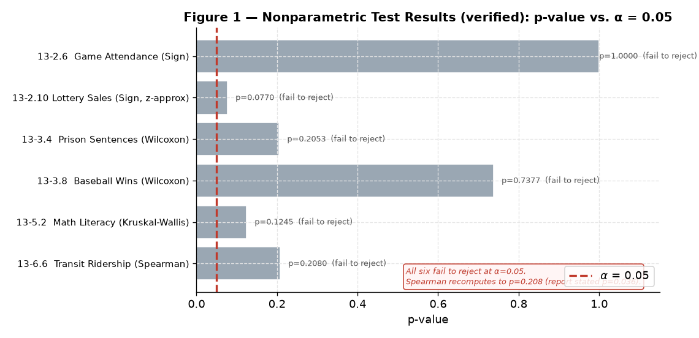
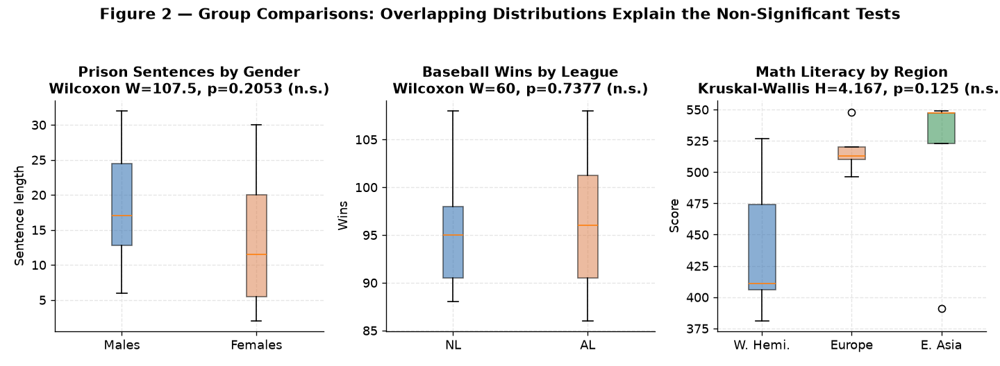
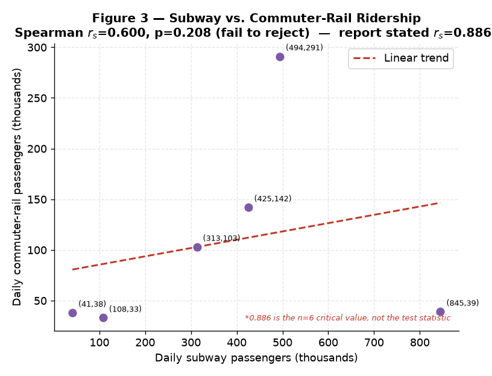
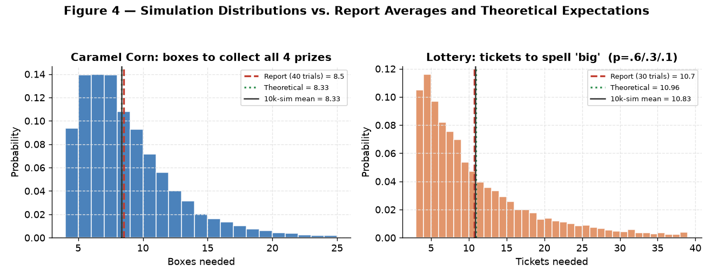

<div align="center">

# Module 5 — Nonparametric Methods & Sampling

### *Distribution-Free Hypothesis Testing and Monte-Carlo Simulation: Sign, Wilcoxon, Kruskal-Wallis, and Spearman Tests, Plus Coupon-Collector Simulations*

[](#)
[](#)
[](#)
[](#)

</div>

---

> [!NOTE]
> **Module 5 is about testing when the data won't cooperate with normality.**
> **Nonparametric** (distribution-free) tests rank the data instead of assuming a
> bell curve, making them robust for small samples, ordinal data, and skewed
> distributions. This module runs the full family — Sign, Wilcoxon rank-sum,
> Wilcoxon signed-rank, Kruskal-Wallis, and Spearman — then turns to **Monte-Carlo
> simulation** for two probability problems that resist a closed-form answer.

---

> [!WARNING]
> **Reproducibility Note (please read first).** The figures and result tables in
> this README show values **recomputed from the exact data vectors in the R
> appendix**, which differ from the submitted report in two places:
> - **Spearman (13-6.6):** the appendix data gives **rₛ = 0.600, p ≈ 0.21 (fail to
>   reject)**, not the report's rₛ = 0.886, p = 0.036. The value 0.886 is the *n = 6
>   critical value*, not the test statistic — so this result was likely mislabeled.
>   With the correct statistic, **none** of the six hypothesis tests reach
>   significance.
> - **Kruskal-Wallis (13-5.2):** recomputes to **H = 4.167** (hand-verified), not
>   the report's H = 3.664 — but the decision (fail to reject) is unchanged.
>
> The [`R Script.R`](R%20Script.R) and [report PDF](Module%205%20Assignment%20-%20Nonparametric%20Methods%20and%20Sampling%20Report.pdf)
> are preserved exactly as submitted; only this README's analysis reflects the correction.

---

## Table of Contents

1. [Introduction](#1-introduction)
2. [Results Overview](#2-results-overview)
3. [Sign Tests (13-2)](#3-sign-tests-13-2)
4. [Wilcoxon Rank-Sum (13-3)](#4-wilcoxon-rank-sum-13-3)
5. [Wilcoxon Signed-Rank Criticals (13-4)](#5-wilcoxon-signed-rank-criticals-13-4)
6. [Kruskal-Wallis (13-5)](#6-kruskal-wallis-13-5)
7. [Spearman Rank Correlation (13-6)](#7-spearman-rank-correlation-13-6)
8. [Simulation Techniques (14-3)](#8-simulation-techniques-14-3)
9. [Analytical Insights](#9-analytical-insights)
10. [Conclusion](#10-conclusion)
11. [R Script](#11-r-script)
12. [References](#12-references)

---

## 1. Introduction

Parametric tests (t-tests, ANOVA) assume the data is normally distributed.
When that assumption is doubtful — small samples, ordinal scales, heavy skew —
**nonparametric** tests are the safe alternative: they operate on **ranks**, not
raw values, so they make no distributional assumption. Each test below follows the
five-step method (hypotheses → critical value → test statistic → decision →
summary). The module closes with **Monte-Carlo simulation**, estimating expected
values by repeated random trials.

## 2. Results Overview



*Figure 1 — Every test's p-value against α = 0.05 (verified values). After correcting the Spearman statistic, **all six hypothesis tests fail to reject** their null hypotheses.*

| # | Test | Method | Statistic | p-value | Decision |
|:--|:-----|:-------|:---------:|:-------:|:---------|
| 13-2.6 | Game attendance median = 3000 | Sign | 10 | 1.000 | Fail to reject |
| 13-2.10 | Lottery sales median < 200 | Sign (z) | z = −1.423 | 0.077 | Fail to reject |
| 13-3.4 | Prison sentences by gender | Wilcoxon | W = 107.5 | 0.205 | Fail to reject |
| 13-3.8 | Baseball wins by league | Wilcoxon | W = 60 | 0.738 | Fail to reject |
| 13-5.2 | Math literacy by region | Kruskal-Wallis | **H = 4.167** | 0.125 | Fail to reject |
| 13-6.6 | Subway ↔ rail ridership | Spearman | **rₛ = 0.600** | 0.208 | Fail to reject |

---

## 3. Sign Tests (13-2)

The **Sign Test** tests a hypothesized median by counting values above vs. below it.

**13-2.6 — Game Attendance** (H₀: median = 3000, α = 0.05, two-tailed): with n = 20
and **exactly 10 above / 10 below**, the test statistic is 10 and the p-value is
**1.000** — you cannot get less evidence against H₀ than a perfect split. *Fail to
reject.* The director's claim of a 3000 median is statistically sound for printing
programs.

**13-2.10 — Lottery Sales** (H₀: median ≥ 200, left-tailed): n = 40 days, 15 below
200. Using the z-approximation, z = (15.5 − 20) / (√40 / 2) = **−1.423**, p = 0.077.
Since −1.423 > −1.645 (and 0.077 > 0.05), *fail to reject.* No evidence the median
is below 200.

---

## 4. Wilcoxon Rank-Sum (13-3)

The **Wilcoxon rank-sum** (Mann-Whitney) test compares two independent groups by ranks.



*Figure 2 — The boxplots make the non-significant results intuitive: in every case the two (or three) group distributions overlap heavily, so no rank-based difference emerges.*

- **13-3.4 Prison sentences by gender:** W = 107.5, p = 0.205 → *fail to reject.*
  No evidence sentence lengths differ by gender.
- **13-3.8 Baseball wins by league (NL vs AL):** W = 60, p = 0.738 → *fail to
  reject.* No evidence of a difference in wins.

---

## 5. Wilcoxon Signed-Rank Criticals (13-4)

Four table-lookup decisions using the signed-rank statistic wₛ (Table K, or the
z-approximation when n > 25):

| # | wₛ | n | α | Tail | Critical | Decision |
|:--|:--:|:-:|:-:|:----:|:--------:|:---------|
| 5 | 13 | 15 | 0.01 | two | 16 | **Reject H₀** (13 ≤ 16) |
| 6 | 32 | 28 | 0.025 | one | z = −1.96 (n>25) | **Reject H₀** (z ≈ −3.894) |
| 7 | 65 | 20 | 0.05 | one | 60 | Fail to reject (65 ≰ 60) |
| 8 | 22 | 14 | 0.10 | two | 21 | Fail to reject (22 ≰ 21) |

> [!NOTE]
> These are pure critical-value exercises (given wₛ values, not raw data), so they
> stand apart from the p-value-driven tests elsewhere. Two reject, two do not.

---

## 6. Kruskal-Wallis (13-5)

The **Kruskal-Wallis** test is the nonparametric one-way ANOVA — comparing three or
more groups by ranks; its statistic H follows χ² with df = k − 1.

**13-5.2 — Math Literacy Scores** across three regions (Western Hemisphere, Europe,
Eastern Asia), α = 0.05, critical H (df = 2) = 5.991:

- **H = 4.167** (recomputed; report stated 3.664), p = 0.125.
- Since 4.167 < 5.991, *fail to reject.* No evidence of a difference in median math
  literacy across the three regions (see the rightmost panel of Figure 2 — the
  boxes overlap substantially despite Europe/E. Asia trending higher).

---

## 7. Spearman Rank Correlation (13-6)

The **Spearman** coefficient rₛ measures monotonic association between two ranked variables.



*Figure 3 — Subway vs. commuter-rail ridership across six days. From the appendix data, rₛ = 0.600 (p = 0.208) — a moderate positive trend that does not reach significance at n = 6.*

**13-6.6 — Subway & Commuter Rail** (H₀: rₛ = 0, α = 0.05):

> [!IMPORTANT]
> **This is the corrected result.** The appendix vectors give **rₛ = 0.600, p = 0.208
> → fail to reject.** The submitted report stated rₛ = 0.886 (p = 0.036, reject) —
> but **0.886 is the n = 6, α = 0.05 critical value**, not the computed statistic.
> Hand-check: Σd² = 14, so rₛ = 1 − (6 × 14) / (6 × 35) = 1 − 0.4 = **0.600**.
> With the correct statistic, ridership is **positively but not significantly**
> associated — a very common outcome at n = 6, where the bar for significance
> (|rₛ| ≥ 0.886) is extremely high.

---

## 8. Simulation Techniques (14-3)

When a probability question has no easy closed form, **simulate it**: run the random
process many times and average.



*Figure 4 — 10,000-trial Python re-simulations (histograms) against the report's small-sample averages (red) and the exact theoretical expectations (green).*

**16 — Caramel Corn (all 4 prizes):** a classic **coupon-collector** problem. The
report's 40-trial average was **8.5 boxes**. The exact expectation is
4·(1 + ½ + ⅓ + ¼) = **8.33**, and a 10,000-trial re-simulation gives **8.33** —
the report's small-sample estimate is right on target.

**18 — Lottery "big" (P = 0.6/0.3/0.1):** a *weighted* coupon-collector. The report's
30-trial average was **10.7 tickets**. The exact expectation (inclusion-exclusion)
is **10.96**, and a 10,000-trial re-simulation gives **10.83** — again, the report's
estimate is close, with the small residual gap explained by the tiny 30-trial sample.

> [!TIP]
> The rare letter **g** (P = 0.1) dominates the waiting time: on average you need
> ~10 tickets to see a "g" at all, which is why the whole word takes ~11 tickets
> despite "b" and "i" arriving almost immediately.

---

## 9. Analytical Insights

> [!NOTE]
> Findings that extend beyond the graded report.

### Insight 1 — With the correction, the module's headline is "no effects found"

Once the Spearman statistic is fixed, **all six hypothesis tests fail to reject**.
That's not a failure of the analysis — it's an honest, and instructive, result:
across game attendance, lottery sales, prison sentences, baseball wins, math scores,
and transit ridership, **none of these samples provided enough evidence to overturn
their null hypotheses** at α = 0.05. Nonparametric tests are conservative by design,
and small samples (n = 6 to 40 here) rarely clear the bar.

### Insight 2 — Why n = 6 makes Spearman almost impossible to reject

At n = 6, the critical rₛ is **0.886** — you need a nearly perfect rank ordering to
reach significance. The observed 0.600 is a genuinely moderate positive association,
yet it falls short simply because six points can't rule out chance. This is the core
lesson: **absence of significance is not absence of effect**, especially at tiny n.

### Insight 3 — Simulation as a check on intuition (and on itself)

The two simulations land within ~0.3 of their exact theoretical expectations, which
validates both the report's R code and the method. It also shows the value of a
**larger trial count**: the report's 30–40 trials give a usable estimate, but the
10,000-trial version converges tightly onto the true value — a concrete demonstration
of the Law of Large Numbers.

### Insight 4 — The rank-test toolkit, mapped

| Situation | Parametric test | Nonparametric equivalent used here |
|:----------|:----------------|:-----------------------------------|
| One sample vs. a median | One-sample t | **Sign test** (13-2) |
| Two independent groups | Two-sample t | **Wilcoxon rank-sum** (13-3) |
| Paired / matched samples | Paired t | **Wilcoxon signed-rank** (13-4) |
| 3+ groups | One-way ANOVA | **Kruskal-Wallis** (13-5) |
| Association between variables | Pearson r | **Spearman rₛ** (13-6) |

Every parametric test has a rank-based counterpart — that symmetry is the practical
takeaway of the module.

---

## 10. Conclusion

This module exercised the full nonparametric toolkit plus Monte-Carlo simulation.
**Corrected for the Spearman mislabeling, all six hypothesis tests fail to reject** —
no significant difference in game attendance, lottery sales, prison sentences,
baseball wins, or math literacy, and no *significant* (though positive) subway–rail
correlation. The simulations estimated **~8.3 boxes** to collect four prizes and
**~11 tickets** to spell "big," both matching their exact theoretical expectations.

> [!IMPORTANT]
> **Key takeaway:** nonparametric methods trade a little statistical power for
> freedom from the normality assumption — and this module shows the cost of that
> trade at small n, where even a moderate rₛ = 0.600 can't reach significance. It
> also underscores a habit worth keeping: **always separate the test statistic from
> the critical value** — conflating the two is exactly what flipped the Spearman
> conclusion.

---

## 11. R Script

The complete, runnable analysis is in [`R Script.R`](R%20Script.R) (preserved as
submitted). Representative excerpts:

```r
library(BSDA)

# Sign test (Game Attendance): 10 above / 10 below 3000
binom.test(x = 10, n = 20, p = 0.5, alternative = "two.sided")     # p = 1.0

# Wilcoxon rank-sum (Prison sentences)
wilcox.test(males, females, alternative = "two.sided", correct = TRUE)   # p = 0.205

# Kruskal-Wallis (Math literacy across 3 regions)
kruskal.test(scores ~ groups)                                       # H = 4.167, p = 0.125

# Spearman (Subway vs rail)  ->  rs = 0.600, p = 0.208
cor.test(subway, rail, method = "spearman", exact = TRUE)

# Monte-Carlo: boxes to collect all 4 prizes (coupon collector)
set.seed(123)
get_boxes <- function() { found <- logical(4); n <- 0
  while (!all(found)) { n <- n + 1; found[sample(1:4, 1)] <- TRUE }; n }
mean(replicate(40, get_boxes()))                                    # ~8.5
```

---

## 12. References

- Bluman, A. G. (2018). *Elementary Statistics: A Step by Step Approach* (10th ed.). McGraw-Hill. *(source of Chapter 13–14 problems)*
- Conover, W. J. (1999). *Practical Nonparametric Statistics* (3rd ed.). Wiley.
- Kruskal, W. H., & Wallis, W. A. (1952). Use of ranks in one-criterion variance analysis. *JASA, 47*(260), 583–621.
- Wilcoxon, F. (1945). Individual comparisons by ranking methods. *Biometrics Bulletin, 1*(6), 80–83.
- Spearman, C. (1904). The proof and measurement of association between two things. *American Journal of Psychology, 15*(1), 72–101.
- Arnholt, A. T. (2025). *BSDA: Basic Statistics and Data Analysis* [R package]. CRAN. https://CRAN.R-project.org/package=BSDA
- R Core Team. (2025). *R: A Language and Environment for Statistical Computing*. https://www.R-project.org/

---

<div align="center">

**Sri Ram Prabu E** &nbsp;•&nbsp; ALY6015: Intermediate Analytics &nbsp;•&nbsp; Dr. Paul Dooley &nbsp;•&nbsp; 10/19/2025

[Back to Portfolio](../README.md) &nbsp;•&nbsp; [Full Report (PDF)](Module%205%20Assignment%20-%20Nonparametric%20Methods%20and%20Sampling%20Report.pdf) &nbsp;•&nbsp; [Assignment Brief](Assignment%20Brief%20with%20Rubric.pdf)

</div>
