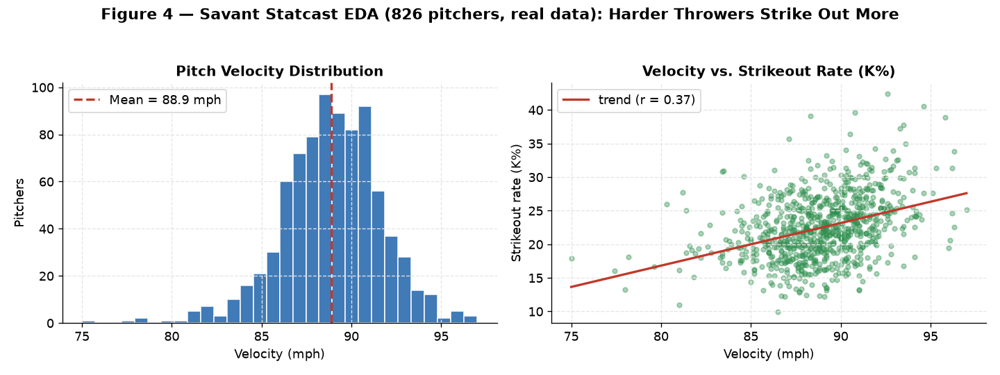
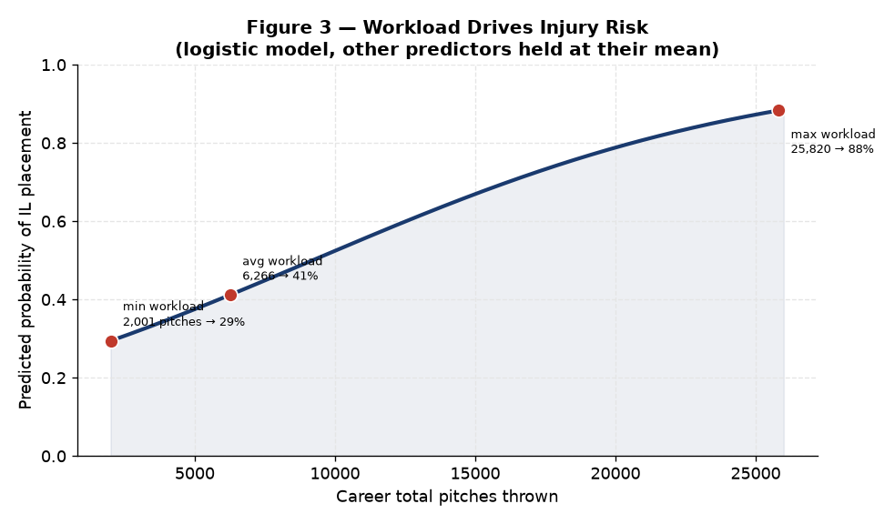
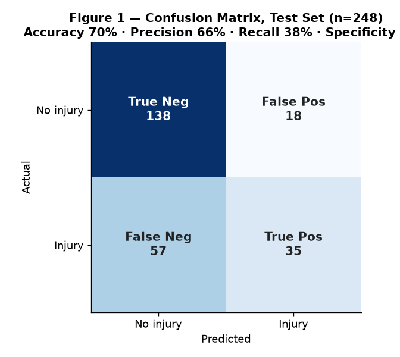
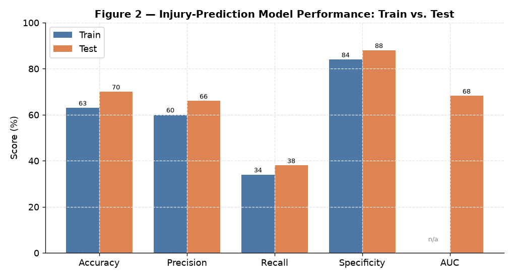
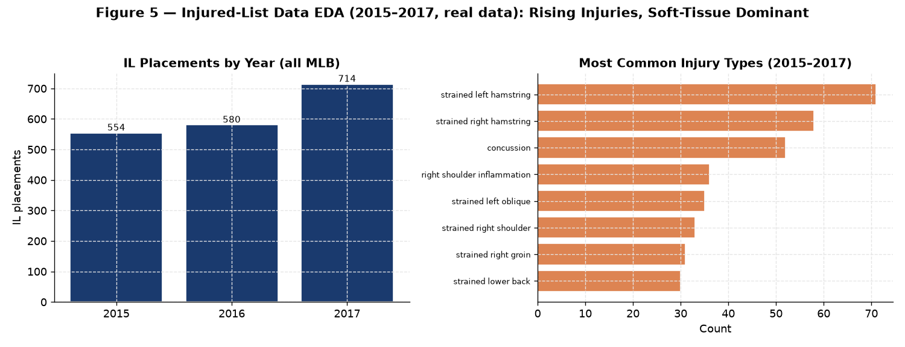

<div align="center">

# Final Project — Pitcher's Stuff & Injury Risk

### *Do a Pitcher's Workload and "Stuff" Predict Injured-List Placement? Merging Lahman, Statcast, and MLB Injury Data to Model Effectiveness, Durability, and Injury Risk*

[](#)
[](#)
[](#)
[](#)

**Group 1 — Francisco Hernandez · Sri Ram Prabu Elenchezhian · Andre Shirevani Harandi**

</div>

---

> [!NOTE]
> **The capstone for ALY6015 — the whole toolkit on one real problem.** MLB pitcher
> injuries are surging in the velocity era. This project merges three sources
> (Lahman career pitching, Baseball Savant Statcast metrics, and MLB injured-list
> records) into one 826-pitcher dataset, then applies **EDA → linear regression →
> logistic regression → model diagnostics → ROC/AUC** to ask a single question:
> **can workload and "stuff" predict which pitchers land on the Injured List?**

---

## Table of Contents

1. [Introduction & Question](#1-introduction--question)
2. [Data Preparation & Integration](#2-data-preparation--integration)
3. [Exploratory Data Analysis](#3-exploratory-data-analysis)
4. [Linear Regression — Effectiveness & Durability](#4-linear-regression--effectiveness--durability)
5. [Logistic Regression — Injury Occurrence](#5-logistic-regression--injury-occurrence)
6. [Model Performance & ROC](#6-model-performance--roc)
7. [Analytical Insights](#7-analytical-insights)
8. [Conclusion & Recommendations](#8-conclusion--recommendations)
9. [Project Deliverables](#9-project-deliverables)
10. [R Script](#10-r-script)
11. [References](#11-references)

---

## 1. Introduction & Question

Pitchers are a team's most valuable and most fragile asset. MLB's own 2024 report
links rising pitcher injuries to the chase for **more velocity, nastier stuff, and
max-effort pitching**. This project tests that thesis quantitatively: using
career-level performance metrics and cumulative workload, **does a pitcher's profile
predict Injured-List (IL) placement?**

Three outcomes are modeled:
1. **Effectiveness** — career ERA (linear regression)
2. **Durability** — total career innings pitched (linear regression)
3. **Injury risk** — whether a pitcher was placed on the IL (logistic regression)

## 2. Data Preparation & Integration

Three sources were normalized and merged on standardized player names (an accent-
and suffix-stripping `norm_key` helper handles "José → jose", "Jr./III", spaced
initials, and "Last, First" vs "First Last" ordering):

| Source | Contributes | Scope |
|:-------|:------------|:------|
| **Lahman `Pitching`** (R package) | Career ERA, SO9, BB9, WHIP, IP | Seasons ≥ 2015 |
| **Baseball Savant (Statcast)** | Velocity, spin rate, total pitches, whiffs | 826 qualified pitchers (≥ 2,000 pitches) |
| **MLB Injured List** | Injury count, DL days, binary `injury_occurred` | 2015–2017 |

> [!TIP]
> The merge is the hard part of this project. Duplicate names (two Luis Garcías,
> multiple Chris Smiths) were resolved manually via MLB player IDs and TruMedia
> cross-referencing. The final `pitcher_df` holds **826 pitchers × 48 variables**,
> one row per pitcher.

---

## 3. Exploratory Data Analysis



*Figure 4 — Rendered from the 826-pitcher Statcast data. Velocity centers on **88.9 mph** (matching the report), and velocity correlates positively with strikeout rate (r = 0.37) — harder throwers miss more bats.*

Key descriptive findings and correlations:

| Metric | Value / Relationship |
|:-------|:---------------------|
| Mean career ERA | **4.19** (min 1.67) |
| Mean velocity | **88.9 mph** |
| Mean total pitches | 6,266 |
| ERA ↔ WHIP | **r ≈ 0.81** (strong — more baserunners, more runs) |
| SO9 ↔ ERA | r ≈ −0.49 (strikeouts prevent runs) |
| SO9 ↔ velocity / spin | r ≈ 0.38 / 0.40 (stuff → strikeouts) |
| BB9 ↔ WHIP | r ≈ 0.52 (control matters) |

---

## 4. Linear Regression — Effectiveness & Durability

**Model 1 — Career ERA** (`ERA ~ SO9 + BB9 + velocity + spin_rate`):

| Predictor | Effect on ERA | Significant? |
|:----------|:--------------|:-------------|
| SO9 | **−0.26** per K/9 | *** highly |
| BB9 | **+0.37** per BB/9 | *** highly |
| Velocity | −0.022 per mph | * (p = 0.011) |
| Spin rate | — | n.s. (p = 0.132) |

Adjusted R² = **0.377** — the model explains ~38% of ERA variance. Strikeouts and
control dominate; velocity helps modestly; spin rate adds nothing once the others
are in.

**Model 2 — Durability (total innings)** (same predictors): Adjusted R² = **0.139** —
weak. The standout: each additional **BB9 costs ~142 career innings** — poor control
shortens careers by limiting opportunities. Velocity and spin are not significant.

> [!IMPORTANT]
> The two linear models tell a consistent story: **command (SO9, BB9), not raw
> velocity, drives both effectiveness and longevity.** Velocity is a performance
> asset but a weak standalone predictor of durability.

---

## 5. Logistic Regression — Injury Occurrence

The dataset was split 70/30 (train 578 / test 248). Two logistic models were fit:

- **Model 1** included both `total_pitches` and `IP_total` — but their **VIF values
  were 42.3 and 43.8**, flagging severe multicollinearity (both measure workload).
- **Model 2 (final)** dropped `IP_total`. All VIF < 1.5 — clean.

**Final model:** `injury_occurred ~ total_pitches + velocity + spin_rate + SO9 + BB9`

| Predictor | Odds ratio | Interpretation |
|:----------|:----------:|:---------------|
| **total_pitches** | **1.000122** per pitch | *** highly significant (p = 9.3e-09) — workload ↑ injury odds |
| velocity | 0.940 per mph | marginally significant — more velocity, *slightly* lower injury odds |
| spin_rate, SO9, BB9 | ~1 | not significant |



*Figure 3 — The headline result. Holding other predictors at their mean, predicted IL-placement probability climbs from **29% at the minimum workload (2,001 pitches) to 88% at the maximum (25,820)**. Cumulative workload is the dominant, most reliable injury predictor.*

> [!TIP]
> The velocity odds ratio (0.94) looks paradoxical — shouldn't harder throwers get
> hurt *more*? A likely explanation: **survivorship**. Pitchers who sustain high
> velocity over a long career are the durable ones who weren't already weeded out —
> so within this sample, velocity is mildly protective *after* controlling for
> total workload. Workload is the real risk driver.

---

## 6. Model Performance & ROC



*Figure 1 — Test-set confusion matrix. The model is strong at identifying healthy pitchers (specificity 88%) but weaker at catching injuries (recall 38%).*



*Figure 2 — Performance is consistent between train and test (test actually edges higher), indicating the model generalizes and is not overfit.*

| Metric | Train | Test |
|:-------|:-----:|:----:|
| Accuracy | 63% | **70%** |
| Precision | 60% | 66% |
| Recall (Sensitivity) | 34% | 38% |
| Specificity | 84% | 88% |
| AUC | — | **0.682** |

> [!NOTE]
> **AUC = 0.682** is "fair" discrimination — the model ranks pitchers by injury risk
> meaningfully better than chance, but far from perfectly. That's honest and
> expected: sports injuries are **multifactorial** (mechanics, age, recovery, luck),
> and a handful of career metrics can only capture part of the story. The **low
> recall (38%)** is the model's real weakness — it misses most actual injuries,
> because non-injured pitchers dominate the sample and the 0.5 threshold favors the
> majority class.

---

## 7. Analytical Insights

> [!NOTE]
> Findings and visuals that extend the graded report.

### Insight 1 — Injuries were rising even within the study window



*Figure 5 — Rendered from the raw IL data. League-wide IL placements climbed **554 → 580 → 714** across 2015–2017 (+29% in two years), and soft-tissue strains (hamstring, oblique, shoulder) dominate the injury mix.* The upward trend is the real-world backdrop that makes the workload finding actionable — the problem was worsening even before the pitch-clock era the report discusses.

### Insight 2 — The VIF story is the methodological highlight

Dropping `IP_total` (VIF 43.8) wasn't cosmetic — with both workload measures in the
model, their coefficients would be unstable and uninterpretable. Removing one and
keeping `total_pitches` (a *direct* pitch count) turned an unusable model into a
clean one where **workload emerged as the single dominant predictor**. This is a
textbook demonstration of why multicollinearity diagnostics matter.

### Insight 3 — The model's asymmetry is a feature for its use-case

High specificity (88%) with low recall (38%) means the model rarely cries wolf but
misses many real injuries. For a front office, that profile is **cautious**: it
won't needlessly bench a healthy ace, but it also can't be the sole safeguard. Its
value is as a **risk-ranking tool** (via the probability curve in Figure 3), not a
binary go/no-go — flagging the highest-workload arms for load management.

### Insight 4 — Two "stuff" metrics, two roles

The project cleanly separates what velocity and command each do:
- **Command (SO9/BB9)** → drives *effectiveness and durability* (the linear models)
- **Workload (total pitches)** → drives *injury risk* (the logistic model)
- **Velocity** → helps effectiveness modestly, mildly protective on injury (survivorship)

The strategic implication: **manage workload to prevent injury, develop command to
sustain a career** — velocity alone is neither the problem nor the solution.

---

## 8. Conclusion & Recommendations

Merging career, Statcast, and injury data into one 826-pitcher model showed that
**cumulative workload (total pitches) is the strongest, most reliable predictor of
Injured-List placement** — injury probability rises from 29% to 88% across the
workload range. Command metrics drive effectiveness and longevity; velocity is a
performance asset that is, if anything, mildly protective after controlling for
workload.

> [!IMPORTANT]
> **Strategic recommendation:** teams should treat cumulative pitch count as a
> first-class risk signal — pairing **data-driven workload monitoring** with
> preventive load management, biomechanical evaluation, and off-day optimization for
> high-volume arms. The model isn't precise enough to bench a pitcher on its own
> (AUC 0.682, recall 38%), but it is a defensible tool for **ranking who to watch**.

**Limitations & future work** (from the report): match IL years exactly to the
Statcast window, split starters vs. relievers, and add fatigue/recovery/age
predictors — then move to nonlinear ML models for sharper injury prediction.

---

## 9. Project Deliverables

This folder preserves the full arc of the project as submitted:

| File | Stage |
|:-----|:------|
| [`Proposal - Dataset Selection.pdf`](Proposal%20-%20Dataset%20Selection.pdf) | Proposal & data sourcing |
| [`Initial Analysis Report.pdf`](Initial%20Analysis%20Report.pdf) | EDA + linear models |
| [`Draft Report.pdf`](Draft%20Report.pdf) | Adds logistic model (train-set results) |
| [`Final Project - Report.pdf`](Final%20Project%20-%20Report.pdf) | Complete analysis + test-set evaluation |
| [`R Script.R`](R%20Script.R) | Full pipeline: merge → EDA → lm → glm → ROC |
| `savant_data.csv`, `injuries.csv` | The two external datasets (Lahman is loaded from its R package) |

---

## 10. R Script

The complete pipeline is in [`R Script.R`](R%20Script.R). Structure:

```r
library(tidyverse); library(Lahman); library(stringi)

# 1. Normalize names, aggregate Lahman career pitching (>= 2015)
# 2. Merge Savant Statcast (velocity, spin, total_pitches) by name key
# 3. Integrate MLB injured-list data (2015-2017) -> injury_occurred (binary)
#    -> pitcher_df: 826 pitchers x 48 variables

# EDA: summary, correlation matrix + corrplot, histograms, scatterplots

# Linear models
lm_era <- lm(ERA_career ~ SO9_career + BB9_career + velocity + spin_rate, data = pitcher_df)
lm_ip  <- lm(IP_total  ~ SO9_career + BB9_career + velocity + spin_rate, data = pitcher_df)

# Logistic model (drop IP_total for multicollinearity; VIF was ~44)
set.seed(123)
model2 <- glm(injury_occurred ~ total_pitches + velocity + spin_rate + SO9_career + BB9_career,
              data = train, family = binomial)
exp(coef(model2))                              # odds ratios
confusionMatrix(pred, test$injury_occurred, positive = "Yes")
auc(roc(test$injury_occurred, probabilities.test))   # 0.682
```

---

## 11. References

- Adler, D. (2024, Dec 17). *MLB releases report on injuries to pitchers*. MLB.com. https://www.mlb.com/news/mlb-releases-report-on-pitcher-injuries-2024
- Friendly, M., et al. (2023). *Lahman: Sean Lahman Baseball Database* [R package]. https://cran.r-project.org/package=Lahman
- Baseball Savant. (n.d.). *Statcast Search*. https://baseballsavant.mlb.com/statcast_search
- robotallie. (2025). *baseball-injuries/injuries.csv* [Data set]. GitHub. https://github.com/robotallie/baseball-injuries
- TruMedia Networks. (2019). https://www.trumedianetworks.com/
- R Core Team. (2025). *R: A Language and Environment for Statistical Computing*. https://www.R-project.org/

---

<div align="center">

**Group 1** — Francisco Hernandez · Sri Ram Prabu Elenchezhian · Andre Shirevani Harandi
ALY6015: Intermediate Analytics &nbsp;•&nbsp; Dr. Paul Dooley &nbsp;•&nbsp; October 25, 2025

[Back to Portfolio](../README.md) &nbsp;•&nbsp; [Final Report (PDF)](Final%20Project%20-%20Report.pdf)

</div>
