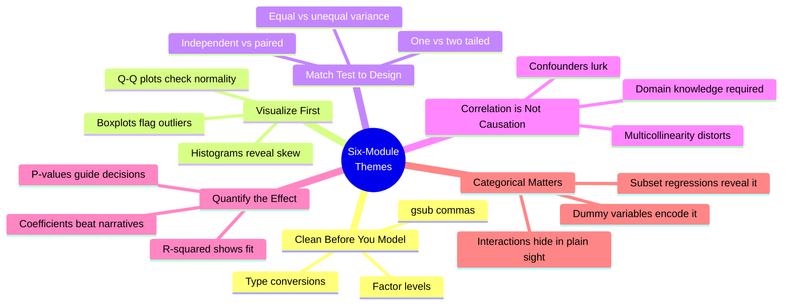

<div align="center">

# R Practice Portfolio — ALY6010

### *Probability Theory & Statistical Modeling in R — A Six-Module Journey*

[](#)
[](#)
[](#)
[](#)

**[Browse Modules ↓](#the-six-modules)** &nbsp;•&nbsp; **[Datasets Used ↓](#datasets-used)** &nbsp;•&nbsp; **[Final Reflection ↓](#final-reflection)**

</div>

---

> [!NOTE]
> This portfolio consolidates six weeks of applied R practice from
> **ALY6010 — Probability Theory and Introductory Statistics**.
> Each module builds on the last — moving from raw data wrangling to descriptive
> statistics, hypothesis testing, correlation, and finally multivariable
> regression with categorical interaction effects.

---

## The Statistical Arc


---

## The Six Modules

| # | Module | Dataset | Core Technique |
|:-:|:-------|:--------|:---------------|
| 1️⃣ | **[Exploratory Data Analysis](#1️⃣-module-1--exploratory-data-analysis-of-lung-capacity)** | Lung Capacity | Frequency tables, histograms, ggplot2 visualizations |
| 2️⃣ | **[Descriptive Statistics](#2️⃣-module-2--descriptive-statistics-of-activity-data)** | Strava Activities | Mean / SD / N tables, scatter / jitter / boxplots |
| 3️⃣ | **[One-Sample Hypothesis Testing](#3️⃣-module-3--hypothesis-testing-on-covid-19-mortality)** | COVID-19 Deaths | One-sample t-tests, proportion tests |
| 4️⃣ | **[Two-Sample & Paired t-Tests](#4️⃣-module-4--t-test-analysis-of-cat-weight-and-sleep-quality)** | Cats (MASS) + Sleep | Welch's t-test, paired t-test |
| 5️⃣ | **[Correlation & Regression](#5️⃣-module-5--socio-economic-predictors-of-maternal-mortality)** | World Bank WDI | Correlation matrix, OLS regression |
| 6️⃣ | **[Dummy Variables & Subset Models](#6️⃣-module-6--dummy-variables--subset-regression-on-health-data)** | Apple Health | Dummy encoding, separate subset regressions |

> [!TIP]
> Each module below is collapsible — click any title to expand the full module.

---

### 1️⃣ Module 1 — Exploratory Data Analysis of Lung Capacity

<details>
<summary><b>Click to expand the full module</b></summary>

<br>

> [!IMPORTANT]
> **Assignment Objective:** Import a dataset using `read.csv()`, prepare a clean
> `data.frame` (rename, drop, structure types), and produce frequency tables,
> cross-tabulations, and histograms — comparing results across multiple classes.

#### Dataset

**LungCapData.csv** — measurements of lung capacity along with demographic and
behavioral variables.

#### Variables of Interest

| Variable | Type | Description |
|:---------|:-----|:------------|
| `lung_capacity` | Numeric | Measured lung capacity in liters (L) |
| `age` | Integer | Subject's age in years |
| `height_in` | Numeric | Subject's height in inches |
| `smoker` | Factor | Tobacco use: "Smoker" / "Non-smoker" |
| `gender` | Factor | "Male" / "Female" |
| `c_section` | Factor | Caesarean section delivery: "Yes" / "No" |

#### Data Cleaning Performed

```r
df_clean <- df %>%
  rename(
    lung_capacity = LungCap,
    age           = Age,
    height_in     = Height,
    smoker        = Smoke,
    gender        = Gender,
    c_section     = Caesarean
  ) %>%
  filter(!is.na(lung_capacity), !is.na(age), !is.na(gender)) %>%
  mutate(
    smoker    = str_to_lower(str_trim(smoker)),
    gender    = str_to_lower(str_trim(gender)),
    c_section = str_to_lower(str_trim(c_section))
  ) %>%
  mutate(
    smoker        = factor(ifelse(smoker == "yes", "Smoker", "Non-smoker")),
    gender        = factor(ifelse(gender == "male", "Male", "Female")),
    c_section     = factor(ifelse(c_section == "yes", "Yes", "No")),
    age           = as.integer(age),
    height_in     = as.numeric(height_in),
    lung_capacity = as.numeric(lung_capacity)
  )
```

**Steps taken:**

1. **Renaming** — Standardized column names (`LungCap` → `lung_capacity`)
2. **Missing values** — Removed rows with `NA` in any of `lung_capacity`, `age`, or `gender`
3. **Whitespace & case** — Trimmed leading/trailing spaces and converted text to lowercase
4. **Re-coding** — Converted yes/no strings to factor levels
5. **Type conversion** — `age` → integer; `height_in` and `lung_capacity` → numeric

#### Initial Analysis Steps

1. **Frequency Distributions** — Gender and smoker status using `table()`
2. **Cross-Tabulation** — Smoker × Gender using `ftable()` and `gmodels::CrossTable()`
3. **Base-R Histograms** — Lung capacity and age distributions
4. **ggplot2 Visualizations** — Faceted and overlay histograms
5. **Interactive Scatter Plot** — Lung capacity vs. height via `plotly`
6. **Boxplots** — Lung capacity across gender × smoker status

#### Charts, Tables & Figures Created

| Table # | Description |
|:--------|:------------|
| 1 | Frequency of Gender |
| 2 | Frequency of Smoker Status |
| 3 | Cross-tab: Smoker × Gender |

| Figure # | Description |
|:---------|:------------|
| 1 | Histogram of Lung Capacity |
| 2 | Age Distribution by Smoker Status (overlay) |
| 3 | Lung Capacity by Smoker Status (faceted) |
| 4 | Interactive Scatter — Lung Capacity vs. Height |
| 5 | Boxplot — Lung Capacity by Gender × Smoker Status |

#### Key Findings

- **Gender distribution:** Roughly balanced Male vs. Female
- **Smoker status:** Fewer smokers than non-smokers in the sample
- **Smoker × Gender:** Slightly more smokers among males
- **Lung capacity:** Approximately normal distribution with slight right skew
- **Smoker effect:** Lower average lung capacity among smokers
- **Age × Smoking:** Smokers concentrated in mid-teens; non-smokers skew younger
- **Height vs. Lung Capacity:** Strong positive correlation
- **Gender × Smoker boxplots:** Lower median lung capacity in females and smokers

> [!TIP]
> **How do you compare results across multiple classes?** Faceted plots
> (`facet_wrap(~ smoker)`) and grouped boxplots (`fill = smoker`) are the
> cleanest way — they put the comparison directly in front of the reader
> without needing to overlay axes.

</details>

---

### 2️⃣ Module 2 — Descriptive Statistics of Activity Data

<details>
<summary><b>Click to expand the full module</b></summary>

<br>

> [!IMPORTANT]
> **Assignment Objective:** Produce descriptive statistics tables (mean, SD,
> min, max, N) for the entire sample and by group. Use `par()` and `abline()`
> to produce scatter, jitter, and boxplot charts.

#### Dataset

**Activities.csv** — 40 personal workout sessions exported from a Garmin /
Strava-style fitness tracker, including cycling, indoor cycling, resort skiing,
road cycling, and virtual cycling.

#### Data Preparation

Numeric fields (`Distance`, `Calories`, `AvgHR`, `MaxHR`, `AvgSpeed`,
`TotalAscent`, `TotalDescent`) arrived as character strings with embedded
commas. They were stripped and converted to numeric:

```r
for (col in numeric_cols) {
  if (is.character(df[[col]]) || is.factor(df[[col]])) {
    df[[col]] <- as.numeric(gsub(",", "", as.character(df[[col]])))
  }
}
df$Date     <- as.POSIXct(df$Date, format = "%Y-%m-%d %H:%M:%S")
df$Favorite <- as.logical(df$Favorite)
```

#### Descriptive Statistics — Overall Sample (n = 40)

| Variable | Mean | SD | Notes |
|:---------|-----:|----:|:------|
| Distance | 22.3 | 16.1 | Wide spread of short and long sessions |
| Calories | 847.7 | 524.3 | Substantial variability in workout intensity |
| AvgHR (n=26) | 130.2 bpm | 20.3 | Moderate-to-high intensity sessions |
| MaxHR (n=26) | 158.7 bpm | 20.9 | Peak effort consistent across sessions |
| AerobicTE | 67.6 | 42.3 | Some sessions provide far higher training effect |
| AvgSpeed (n=33) | 12.56 | 7.10 | — |
| MaxSpeed (n=33) | 24.87 | 10.34 | — |
| Ascent/Descent | ~285 ft | ~387 | Skewed by ski sessions reaching 1,739 ft |

#### Descriptive Statistics — By Activity Type

| Activity | n | Mean Distance | Mean Calories | Mean AvgHR | Notes |
|:---------|:-:|--------------:|--------------:|-----------:|:------|
| Road Cycling | 29 | 27.41 | 794.7 | 135.3 bpm | Largest group; rolling terrain |
| Resort Skiing | 7 | 23.52 | 1,268.6 | 114.9 bpm | Lower HR but huge elevation (~1,730 ft) |
| Virtual Cycling | 2 | 15.72 | 281.5 | — | No HR data recorded |
| Cycling | 1 | 13.92 | 441.0 | 133 bpm | Single outdoor session |
| Indoor Cycling | 1 | 0.0 | — | — | Stationary bike — no distance/HR captured |

> [!NOTE]
> **Three-line table format** (common in white papers): a top rule, a single
> rule under the header row, and a bottom rule. No internal vertical lines and
> no row dividers within the body. The format above mirrors this.

#### Visualizations

**Figure 1 — Scatter Plot: Distance vs. Calories**
> Positive linear trend confirmed by the regression line. Most points fall
> between 10–40 distance units. A few extreme values (Distance > 70) drive the
> slope upward.

**Figure 2 — Jitter Plot: AvgHR by Activity Type**
> Road Cycling clusters at 130–150 bpm; Resort Skiing sits lower at ~100–120 bpm.
> Jittering prevents the dozens of overlapping Road Cycling points from
> stacking invisibly on top of each other.

**Figure 3 — Boxplot: AvgSpeed by Activity Type**
> Road Cycling: median ~17 mph (IQR 12–22), with sprint outliers > 25 mph.
> Resort Skiing: median ~8.5 with wide IQR (5–12), reflecting varied terrain.
> Outliers above whiskers flag potentially anomalous sessions for review.

> [!TIP]
> **When do you use a jitter chart?** When you have a categorical x-axis with
> many repeated y-values — without jitter, points stack on top of each other
> and the distribution within each category disappears. **How do boxplots
> detect outliers?** Any point beyond `Q3 + 1.5×IQR` or below `Q1 − 1.5×IQR`
> is plotted as an individual dot — these are flagged as potential outliers.

#### Conclusions and Recommendations

- **Performance Variability:** Road Cycling drives moderate-to-high HR and
  speed; Resort Skiing drives elevation but lower HR.
- **Data Quality:** A few records had missing or zeroed fields (Indoor Cycling,
  some Distance = 0). Future data collection should ensure HR and distance
  sensors stay synced.
- **Outlier Detection:** Boxplots identified sessions with extreme speeds or
  elevation gains. Investigating those — very long downhill runs or
  exceptionally fast sprints — can inform training plans or reveal sensor
  misreads.

</details>

---

### 3️⃣ Module 3 — Hypothesis Testing on COVID-19 Mortality

<details>
<summary><b>Click to expand the full module</b></summary>

<br>

> [!IMPORTANT]
> **Assignment Objective:** Conduct a one-sample t-test for the mean using an
> appropriate variable. Conduct hypothesis testing for a proportion (p-value).
> State hypotheses, provide test results, and interpret the results.

#### Dataset

**Provisional COVID-19 Death Counts, Rates, and Percent of Total Deaths by
Jurisdiction of Residence** — sourced from `data.gov` (U.S. Department of
Health and Human Services). The cleaned dataset contains `COVID_deaths` and
`crude_COVID_rate` (deaths per 100,000 population) across U.S. jurisdictions.

#### Test 1 — One-Sample t-Test on Total COVID-19 Deaths

**Hypotheses:**

- **H₀:** μ = 10,000 (mean COVID-19 deaths equals 10,000)
- **H₁:** μ ≠ 10,000

**R Code:**

```r
t_test_deaths <- t.test(df_clean$COVID_deaths, mu = 10000)
print(t_test_deaths)
```

**Results:**

```
t ≈ 26.67     p-value < 0.001
Observed mean ≈ 24,770 deaths
```

> [!TIP]
> **Interpretation:** Reject H₀. The average number of COVID-19 deaths across
> jurisdictions is significantly higher than 10,000 — the observed mean of
> ~24,770 deaths reflects a severe mortality toll from the pandemic.

#### Test 2 — One-Sample t-Test: Crude Death Rate > 100

**Hypotheses:**

- **H₀:** μ ≤ 100 deaths per 100,000 population
- **H₁:** μ > 100 deaths per 100,000 population

**R Code:**

```r
t_test_rate <- t.test(df_clean$crude_COVID_rate, mu = 100, alternative = "greater")
```

**Results:**

```
t ≈ 56.52     p-value ≈ 0
```

> [!TIP]
> **Interpretation:** Reject H₀. The mean crude COVID-19 death rate is
> significantly greater than 100 deaths per 100,000 — confirming widespread
> and substantial mortality impact at the population level.

#### Test 3 — Proportion Test: Fewer Than 50% of Jurisdictions Above 200/100k

**Hypotheses:**

- **H₀:** p ≥ 0.50 (at least half of jurisdictions exceed 200/100k)
- **H₁:** p < 0.50

**R Code:**

```r
threshold <- 200
n_total <- length(df_clean$crude_COVID_rate)
n_high  <- sum(df_clean$crude_COVID_rate > threshold)
prop_test <- prop.test(x = n_high, n = n_total, p = 0.5, alternative = "less")
```

**Results:**

```
Observed proportion ≈ 30%     p-value < 0.05
```

> [!TIP]
> **Interpretation:** Reject H₀. Fewer than 50% of jurisdictions experienced
> extremely high crude death rates. Severe mortality was concentrated in a
> minority of regions — strong evidence of geographic disparity in pandemic impact.

#### Visualizations Produced

| Figure | Type | Purpose |
|:-------|:-----|:--------|
| 1 | Histogram of COVID_deaths | Distribution with red dashed line at hypothesized mean (10,000) |
| 2a | Histogram of crude_COVID_rate | With blue dashed line at threshold (100/100k) |
| 2b | Boxplot of crude_COVID_rate | Shows IQR, median, and outliers vs. 100/100k threshold |
| 3 | Bar chart | Proportion of jurisdictions above vs. below 200/100k |

#### Overall Insight

> [!WARNING]
> COVID-19 had a severe national impact, **but the burden was not evenly
> distributed**. Public health strategies should consider both national
> averages and local severity patterns — focusing intervention resources on
> high-burden areas rather than applying uniform policy.

#### Key Takeaways

- COVID-19 deaths were **significantly higher** than the 10,000 benchmark
- The average crude COVID-19 death rate **exceeded 100/100k** across jurisdictions
- High death rates were **not universal** — only ~30% of jurisdictions, revealing regional disparities

</details>

---

### 4️⃣ Module 4 — t-Test Analysis of Cat Weight and Sleep Quality

<details>
<summary><b>Click to expand the full module</b></summary>

<br>

> [!IMPORTANT]
> **Assignment Objective:** Conduct two t-tests using the `MASS::cats` dataset
> and provided sleep-quality scores. Part 1 — two-sample t-test with unequal
> variances. Part 2 — paired-samples t-test. Justify the choice of test in
> each case.

This module is the **most theoretically rigorous** of the six — covering both
independent and dependent samples designs with full assumption checking via
Q-Q plots.

#### Part 1 — Cat Bodyweight: Welch's Two-Sample t-Test

**Research Question:** *"Do male and female cat samples have the same
bodyweight (`Bwt`)?"*

##### Justification for Welch's t-test

The two samples (male and female cats) are **independent groups**. Since we do
not have prior knowledge that the variances of the two groups are equal,
**Welch's t-test** (`var.equal = FALSE`) is the safer choice over Student's
t-test. It adjusts its degrees of freedom to remain reliable even if the
equal-variance assumption is violated. Significance level: **α = 0.05**.

##### Hypotheses (two-tailed)

- **H₀:** μ_male = μ_female (no difference in mean bodyweight)
- **Hₐ:** μ_male ≠ μ_female (significant difference exists)

##### R Code

```r
library(MASS)
data(cats)

male_bwt   <- subset(cats, subset = (cats$Sex == "M"))$Bwt
female_bwt <- subset(cats, subset = (cats$Sex == "F"))$Bwt

bwt_test <- t.test(male_bwt, female_bwt, var.equal = FALSE)
print(bwt_test)
```

##### Statistical Output

```
        Welch Two Sample t-test

data:  male_bwt and female_bwt
t = 8.7095, df = 136.84, p-value = 8.831e-15
alternative hypothesis: true difference in means is not equal to 0
95 percent confidence interval:
 0.4177242  0.6631268
sample estimates:
mean of x   mean of y
 2.900000   2.359574
```

##### Assumption Checks

| Figure | Visualization | What It Shows |
|:-------|:--------------|:--------------|
| 1 | Boxplot of Bwt by Sex | Median male bodyweight clearly higher; entire male IQR sits above female median |
| 2 | Q-Q Plots (side-by-side) | Data points fall close to the reference line for both groups → reasonably normal |

##### Findings

> [!TIP]
> **p-value = 8.831e-15** — extraordinarily small (≪ α = 0.05). Reject H₀.
> Male cats weigh significantly more on average (2.90 kg) than female cats
> (2.36 kg). The 95% CI for the difference is **[0.42, 0.66] kg** — does not
> contain zero, further supporting the conclusion.

#### Part 2 — Sleep Quality: Paired-Samples t-Test

**Research Question:** *"Does meditation improve sleeping quality?"* Ten
students wore sleep evaluators and rated their sleep quality (0–10 scale)
before and after a meditation workshop.

##### Sample Data

| Student | Before | After | Δ (After − Before) |
|:-------:|:------:|:-----:|:------------------:|
| 1 | 4.6 | 6.6 | +2.0 |
| 2 | 7.8 | 7.7 | −0.1 |
| 3 | 9.1 | 9.0 | −0.1 |
| 4 | 5.6 | 6.2 | +0.6 |
| 5 | 6.9 | 7.8 | +0.9 |
| 6 | 8.5 | 8.3 | −0.2 |
| 7 | 5.3 | 5.9 | +0.6 |
| 8 | 7.1 | 6.5 | −0.6 |
| 9 | 3.2 | 5.8 | +2.6 |
| 10 | 4.4 | 4.9 | +0.5 |

##### Why a Paired t-Test?

The two sets of measurements come from the **same 10 students** — they are
dependent (paired) samples. An independent-samples t-test would be incorrect
because it would ignore the fact that each "after" score is linked to a
specific "before" score. By analyzing the difference per individual, the
paired t-test controls for between-subject variability (some students are
just naturally better sleepers) and yields a more powerful analysis of the
intervention's effect.

##### Hypotheses (one-tailed: directional)

- **H₀:** μ_d ≤ 0 (no improvement)
- **Hₐ:** μ_d > 0 (meditation improves sleep)

##### R Code

```r
before_scores <- c(4.6, 7.8, 9.1, 5.6, 6.9, 8.5, 5.3, 7.1, 3.2, 4.4)
after_scores  <- c(6.6, 7.7, 9.0, 6.2, 7.8, 8.3, 5.9, 6.5, 5.8, 4.9)

sleep_test <- t.test(after_scores, before_scores,
                     paired = TRUE, alternative = "greater")
print(sleep_test)
```

##### Statistical Output

```
        Paired t-test

data:  after_scores and before_scores
t = 1.9481, df = 9, p-value = 0.04161
alternative hypothesis: true mean difference is greater than 0
95 percent confidence interval:
 0.03659503        Inf
sample estimates:
mean difference
           0.62
```

##### Visualizations Produced

| Figure | Description | Insight |
|:-------|:------------|:--------|
| 3 | Boxplot of differences (After − Before) | Median is positive; IQR sits above zero — most students improved |
| 4 | Paired line plot (ggplot2) | 8 of 10 students show upward lines; 2 show slight decrease |
| 5 | Alternative line view by Subject ID | Side-by-side before/after trajectory for each student |

##### Findings — α = 0.05 vs. α = 0.10

| α level | p-value | Decision | Conclusion |
|:-------:|:-------:|:--------:|:-----------|
| 0.05 | 0.0416 | **Reject H₀** | Meditation significantly improves sleep |
| 0.10 | 0.0416 | **Reject H₀** | Same conclusion holds; evidence is *even stronger* relative to the more lenient threshold |

> [!TIP]
> The conclusion does not change between the two significance levels. The mean
> improvement was **0.62 points** on the 10-point scale — a meaningful, real
> effect, not random variation.

#### Module 4 Conclusion

This module demonstrated the critical importance of **selecting the
appropriate t-test for the data structure**:

- **Independent groups** (male vs. female cats with unknown variance equality)
  → Welch's two-sample t-test
- **Repeated measures on the same subjects** (before/after meditation) →
  Paired t-test

Both tests yielded statistically significant results supported by visual
assumption checks (Q-Q plots, boxplots, line plots), demonstrating that
choosing the right test is as important as the test itself.

</details>

---

### 5️⃣ Module 5 — Socio-Economic Predictors of Maternal Mortality

<details>
<summary><b>Click to expand the full module</b></summary>

<br>

> [!IMPORTANT]
> **Assignment Objective:** Produce a correlation table/chart (no more than 5
> variables) and a regression table. Pick your own outcome and predictors.
> Discuss how regression differs from correlation.

#### Dataset

**World Bank — World Development Indicators (WDI)** for the year 2017, accessed
via the `WDI` R package. Filtered to 139 countries with complete data on four
indicators:

| Indicator | Role | Description |
|:----------|:-----|:------------|
| **Maternal Mortality Ratio (MMR)** | Outcome | Maternal deaths per 100,000 live births |
| Fertility Rate | Predictor | Total births per woman |
| GDP per Capita (USD) | Predictor | National wealth |
| Health Expenditure per Capita (USD) | Predictor | Healthcare investment |

#### Methodology

1. **Exploratory Data Analysis** — histograms revealed all four variables were
   heavily right-skewed → applied **log transformation** to satisfy OLS
   assumptions and interpret coefficients as elasticities.
2. **Correlation analysis** via `corrplot`.
3. **OLS multiple regression** on log-transformed variables.

#### Part 1 — Correlation Analysis

> [!CAUTION]
> **Why limit correlation charts to ≤5 variables?**
> - **Readability:** Matrix grows quadratically; cells become unreadable
> - **Cognitive overload:** Hard to focus on meaningful findings
> - **Spurious correlations:** With many variables, statistically significant
>   correlations may arise purely by chance

##### Key Analytical Findings

| Pair | Correlation | Interpretation |
|:-----|:-----------:|:---------------|
| 🔴 MMR ↔ Fertility Rate | **+0.79** | Strongest positive — higher birth rates → higher maternal death |
| 🟢 MMR ↔ GDP per Capita | **−0.62** | Strong negative — wealth associated with better outcomes |
| 🟡 MMR ↔ Health Exp. per Capita | **−0.51** | Moderate negative — investment helps |
| 🟠 GDP ↔ Health Exp. per Capita | **+0.85** | **Multicollinearity warning** — wealthier nations spend more on health |

#### Part 2 — Regression Analysis

##### How Regression Differs from Correlation

| Aspect | Correlation | Regression |
|:-------|:------------|:-----------|
| Direction | Symmetric (A↔B = B↔A) | Asymmetric (X → Y) |
| Variable count | Pairwise | Multiple predictors simultaneously |
| Controls for others? | No | Yes — isolates each predictor's unique contribution |
| Output | Single coefficient (strength) | Coefficient + effect size + significance |

##### R Code

```r
regression_model <- lm(
  log(`Maternal Mortality Ratio`) ~ log(`Fertility Rate`) +
                                    log(`Health Exp. (per Capita)`) +
                                    log(`GDP (per Capita)`),
  data = cleaned_data
)
summary(regression_model)
```

##### Regression Results

```
F-statistic: 92.1     p < 0.001     Adjusted R² = 0.690
```

| Predictor | Coefficient (elasticity) | Significance | Interpretation |
|:----------|:------------------------:|:------------:|:---------------|
| log(Fertility Rate) | **+1.11** | p < 0.001 *** | 1% rise in fertility → 1.11% rise in MMR |
| log(GDP per Capita) | **−0.22** | p < 0.10 | 1% rise in GDP → 0.22% fall in MMR |
| log(Health Exp. per Capita) | Not significant | — | Effect absorbed by GDP (multicollinearity at +0.85) |

> [!TIP]
> The model explains **~69% of the variation** in log(MMR) across countries —
> very strong explanatory power. **Fertility rate is the dominant driver**
> once multicollinearity between GDP and health spending is accounted for.

##### Necessary Caveats

> [!WARNING]
> - **Causality:** Cross-sectional design — strong associations, but no
>   causal claims
> - **Omitted variables:** Female education, political stability, and
>   governance quality are missing — their effects may be partially
>   absorbed by the included predictors
> - **Data quality:** Maternal mortality is notoriously difficult to measure
>   accurately in low-resource settings

#### Module 5 Conclusion

Countries with **higher fertility rates and lower economic output** suffer
significantly higher maternal mortality. Health expenditure's apparent effect
is largely captured by GDP per capita — a broader proxy for the resources,
infrastructure, and stability that drive better health outcomes. The findings
support the policy view that **economic growth and investments in education
and family planning** are central to reducing preventable maternal deaths.

</details>

---

### 6️⃣ Module 6 — Dummy Variables & Subset Regression on Health Data

<details>
<summary><b>Click to expand the full module</b></summary>

<br>

> [!IMPORTANT]
> **Assignment Objective:** Using an appropriate variable, create dummy
> variables to subset the dataset. Re-run the regression line for the dependent
> variable. Create separate regression lines for each subset and compare to
> the dummy-variable approach.

#### Dataset

**Health.csv** — personal Apple Health export covering daily wearable metrics:

| Variable | Description |
|:---------|:------------|
| `StepCount` | Number of steps taken |
| `ActiveEnergyBurned` | Calories burned through movement (kcal) |
| `WalkingSpeed` | Average walking speed (m/s) |
| `HeartRate` | Heart rate (bpm) — used as the moderator |
| `DistanceWalkingRunning` | Distance covered (km) |

**Primary research question:** Does **heart-rate intensity moderate** the
relationship between step count and outcomes like calories burned and walking
speed?

#### Creating the Dummy Variable

```r
median_hr <- median(health$HeartRate)
health$HR_Group <- ifelse(health$HeartRate <= median_hr, "LowHR", "HighHR")
```

> [!NOTE]
> The dataset was split at the **median heart rate**, producing two subsets:
> `LowHR` (n ≈ 1,533) and `HighHR` (n ≈ 131). This binary dummy lets us test
> whether step intensity (heart-rate context) changes the effect of taking a step.

#### Approach 1 — Multiple Regression Lines on One Plot (Visual Hypothesis)

Two scatterplots colored by `HR_Group` with separate regression lines:

**Visualization 1 — Active Energy Burned vs. Step Count by HR Group**
> The line for the **HighHR group is much steeper**. For any given increase
> in steps, a person with a higher heart rate burns significantly more
> calories — strong visual evidence of an interaction effect.

**Visualization 2 — Walking Speed vs. Step Count by HR Group**
> Same pattern. The HighHR line rises more steeply, meaning as step count
> increases, average walking speed climbs faster than for the LowHR group.
> Higher-intensity activities yield both faster pace and more energy
> expenditure per step.

#### Approach 2 — Separate Regression Models for Each Subset (Quantitative Proof)

##### Full Dataset Models (Baseline)

**Model 1 — Active Energy ~ Step Count (All Data)**
```
StepCount coefficient: 0.01927     R² = 0.464
```

**Model 2 — Walking Speed ~ Step Count (All Data)**
```
StepCount coefficient: 0.0008514   R² = 0.067
```

##### Subset Models

| Model | Group | Dependent | StepCount Coefficient | R² |
|:-----:|:------|:----------|:---------------------:|:---:|
| 3 | LowHR | ActiveEnergyBurned | **0.02095** | 0.557 |
| 4 | HighHR | ActiveEnergyBurned | **0.00295** | 0.117 |
| 5 | LowHR | WalkingSpeed | **0.00086** | 0.070 |
| 6 | HighHR | WalkingSpeed | **0.00076** | 0.038 |

#### Detailed Breakdown — From Visual Hypothesis to Quantitative Conclusion

> [!TIP]
> **The graphs** (Visualizations 1 & 2) provide quick visual understanding —
> "the HighHR line looks steeper." **The separate models** provide hard
> numbers that let us say *exactly how much* steeper.

##### Comparing Energy Burned (Models 3 vs. 4)

For each additional step:
- **LowHR group:** burns ~0.021 kcal
- **HighHR group:** burns ~0.003 kcal

> The full dataset's steeper line and the LowHR group's steeper line both
> reflect that the LowHR observations (longer continuous walks) carry the
> majority of the data points, so each step there contributes more cumulative
> energy. The HighHR sessions tend to be shorter bursts where steps and
> calories are both already elevated, flattening the marginal effect.

##### Comparing Model Fit (R²)

- **R²** tells us how much of the outcome's variance is explained by `StepCount`
- For **ActiveEnergyBurned**, the LowHR group has R² = **0.557** vs. HighHR
  R² = **0.117** — `StepCount` is a far better predictor of calories within
  the LowHR group than the HighHR group, where other intensity factors
  (cadence, terrain) take over.

#### Module 6 Conclusion

> [!TIP]
> **Key Insight:** While `StepCount` is a strong, statistically significant
> predictor of both `ActiveEnergyBurned` and `WalkingSpeed`, its impact is
> **significantly moderated by `HeartRate`**. The intensity of physical
> activity — not just the volume — fundamentally changes the relationship.

**Takeaways:**

- **Step count is a reliable predictor** — positive and statistically significant
  for both outcomes
- **Heart rate is a critical moderator** — splitting on `HR_Group` reveals
  that the relationship is not uniform across intensity levels
- **Visual + statistical analyses align** — `ggplot2` plots and `lm()`
  summaries told the same story, demonstrating two complementary methods
  for analyzing subgroup differences
- **Dummy variables vs. subset regressions complement each other** — the
  dummy approach is parsimonious; subset regressions reveal interaction
  effects in their full quantitative detail

</details>

---

## Datasets Used

| Module | Dataset | Source | n |
|:------:|:--------|:-------|--:|
| 1 | LungCapData.csv | Provided | — |
| 2 | Activities.csv | Personal Strava export | 40 sessions |
| 3 | Provisional COVID-19 Deaths | data.gov (HHS) | 36,855 records |
| 4 | `MASS::cats` + manual sleep scores | R MASS package + assignment | 144 cats; 10 students |
| 5 | World Bank WDI (2017) | `WDI` R package | 139 countries |
| 6 | Health.csv | Personal Apple Health export | 1,667 daily records |

---

## R Packages Demonstrated

<div align="center">


</div>

| Package | Used In | Purpose |
|:--------|:--------|:--------|
| `dplyr` / `tidyverse` | Modules 1, 2, 5 | Data wrangling pipeline (`%>%`, `mutate`, `filter`, `summarise`) |
| `ggplot2` | Modules 1, 2, 3, 4, 5, 6 | Publication-quality static graphics |
| `plotly` | Module 1 | Interactive scatter plots via `ggplotly()` |
| `gmodels` | Module 1 | `CrossTable()` for SPSS-style cross-tabs |
| `psych` | Module 2 | `describe()` for descriptive stats tables |
| `scales` | Modules 2, 3 | Axis formatting (percent, dollar, alpha shading) |
| `MASS` | Module 4 | `cats` dataset for the Welch's t-test demo |
| `WDI` | Module 5 | World Bank development indicators API |
| `corrplot` | Module 5 | Correlation matrix visualization |
| `stargazer` | Module 5 | Publication-ready regression tables (HTML/LaTeX) |
| `ggthemes` | Module 5 | Additional themes for `ggplot2` |

---

## Repository Structure

```
ALY6010-R-Practice-Portfolio/
├── images/                                            ← all module figures live here
├── data/                                              ← raw datasets
│   ├── Activities.csv
│   ├── Health.csv
│   └── Provisional_COVID-19_death_counts.csv
├── scripts/                                           ← R code per module
│   ├── Module1_LungCapacity_EDA.R
│   ├── Module2_Activities_DescriptiveStats.R
│   ├── Module3_COVID_HypothesisTesting.R
│   ├── Module4_Cats_Sleep_tTests.R
│   ├── Module5_WDI_CorrelationRegression.R
│   └── Module6_Health_DummyVariables.R
├── reports/                                           ← PDF / DOCX deliverables
│   ├── Module1_Report.docx
│   ├── Module2_Report.docx
│   ├── Module3_Report.docx
│   ├── Module4_Report.pdf
│   ├── Module5_Report.docx
│   └── Module6_Report.pdf
└── README.md                                          ← you are here
```

---

## Final Reflection

> [!TIP]
> Six themes thread through the entire portfolio.



1. **Clean before you model.** Every module began with data cleaning —
   `gsub()` to strip commas, type conversions, factor creation. Skipping this
   step poisons every downstream analysis.

2. **Visualize first, model second.** Histograms, Q-Q plots, boxplots, and
   scatterplots revealed skew, normality issues, and potential outliers
   *before* formal tests — pointing to log transformations in Module 5
   and dummy variable splits in Module 6.

3. **Match the test to the design.** Independent samples need different
   handling than paired samples (Module 4). One-sample tests answer
   different questions than proportion tests (Module 3). The structure of
   the data drives the choice of test.

4. **Correlation is not causation.** Module 5's MMR analysis showed strong
   associations between fertility, GDP, and maternal mortality — but
   omitted-variable bias, multicollinearity, and the cross-sectional design
   prevent any causal claim.

5. **Quantify the effect, don't just declare significance.** Module 6
   moved from *"the HighHR line looks steeper"* to *"a step in the LowHR
   group burns 7× more calories than a step in the HighHR group"* — coefficients
   beat narratives every time.

6. **Categorical variables hide interaction effects.** Module 6 showed that
   `StepCount`'s effect on calories depends on which heart-rate group you're
   in. Pooling everything into one model would have obscured this insight
   entirely.

---

## Connect & Discuss

<div align="center">

If you found these modules helpful, spotted an error, or want to compare
R workflows — **open an Issue or start a Discussion**.

[](../../issues)
[](#)

</div>

---

<div align="center">

### Built with curiosity • Written for clarity • Shared for learning

<sub><i>ALY6010 — Probability Theory & Introductory Statistics • Six modules of applied R practice</i></sub>

</div>
