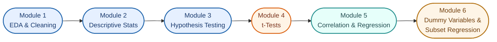
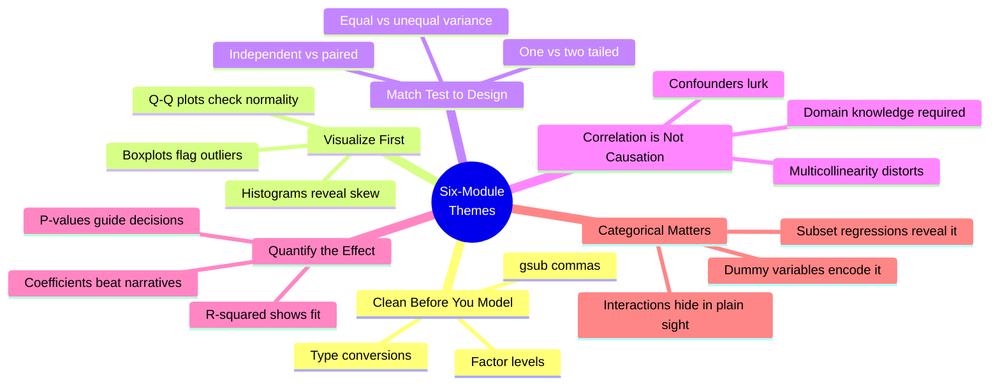

<div align="center">

# R Practice Portfolio — ALY6010

### *Probability Theory & Statistical Modeling in R — A Six-Module Journey*

[](#)
[](#)
[](#)
[](#)
[](#)

**[Browse Modules ↓](#the-six-modules)** &nbsp;•&nbsp; **[Datasets Used ↓](#datasets-used)** &nbsp;•&nbsp; **[Final Reflection ↓](#final-reflection)**

</div>

---

> [!NOTE]
> This portfolio consolidates six weeks of applied R practice from
> **ALY6010 — Probability Theory and Introductory Statistics**.
> Each module is a **standalone report** with its own datasets, R code,
> visualizations, and statistical findings. Modules build on each other —
> moving from raw data wrangling to descriptive statistics, hypothesis
> testing, correlation, and finally multivariable regression with
> categorical interaction effects.

---

## The Statistical Arc



---

## The Six Modules

| # | Module | Dataset | Core Technique | Report |
|:-:|:-------|:--------|:---------------|:-------|
| 1️⃣ | **Exploratory Data Analysis** | Lung Capacity | Frequency tables, histograms, ggplot2 visualizations | [→ Module 1](Module1_ExploratoryDataAnalysis.md) |
| 2️⃣ | **Descriptive Statistics** | Strava Activities | Mean / SD / N tables, scatter / jitter / boxplots | [→ Module 2](Module2_DescriptiveStatistics.md) |
| 3️⃣ | **Hypothesis Testing** | COVID-19 Deaths | One-sample t-tests, proportion tests | [→ Module 3](Module3_HypothesisTesting.md) |
| 4️⃣ | **Two-Sample & Paired t-Tests** | Cats (MASS) + Sleep | Welch's t-test, paired t-test | [→ Module 4](Module4_TwoSampleTests.md) |
| 5️⃣ | **Correlation & Regression** | World Bank WDI | Correlation matrix, OLS regression | [→ Module 5](Module5_CorrelationRegression.md) |
| 6️⃣ | **Dummy Variables & Subset Models** | Apple Health | Dummy encoding, subset regressions | [→ Module 6](Module6_DummyVariables.md) |

---

## Module Quick-Look

### 1️⃣ Module 1 — Exploratory Data Analysis of Lung Capacity

> Foundations of `read.csv()`, `dplyr` cleaning pipelines, factor encoding, and visual EDA via `base R`, `ggplot2`, and `plotly`.

| Highlight | Detail |
|:----------|:-------|
| Variables | `lung_capacity`, `age`, `height_in`, `smoker`, `gender`, `c_section` |
| Key insight | Smokers exclusively in the 11–19 age range — age strongly confounds the smoker effect |
| Figures | 6 (histogram, faceted distributions, scatter, boxplot, cross-tab heatmap) |

**[→ Read the full Module 1 report](Module1_ExploratoryDataAnalysis.md)**

---

### 2️⃣ Module 2 — Descriptive Statistics of Activity Data

> Mean / SD / N tables for the full sample and by activity group, plus the three foundational chart types: scatter, jitter, and boxplot.

| Highlight | Detail |
|:----------|:-------|
| Dataset | 40 Strava workout sessions (Road Cycling dominant at n=29) |
| Key insight | Resort Skiing burns most calories per session (~1,269 kcal) despite the *lowest* heart rate — the elevation effect |
| Figures | 5 (scatter w/ regression line, jitter by activity, boxplot, correlation heatmap, frequency bar) |

**[→ Read the full Module 2 report](Module2_DescriptiveStatistics.md)**

---

### 3️⃣ Module 3 — Hypothesis Testing on COVID-19 Mortality

> One-sample t-tests for means and a proportion test on jurisdictional COVID-19 mortality from data.gov.

| Highlight | Detail |
|:----------|:-------|
| Sample | n = 30,276 jurisdiction-period records |
| Key result | Mean deaths ≈ 24,770 (≫ 10,000 hypothesized); 39.4% of records exceed 200/100k |
| Figures | 4 (deaths histogram, rate histogram, boxplot, proportion bar, Q-Q diagnostic) |

**[→ Read the full Module 3 report](Module3_HypothesisTesting.md)**

---

### 4️⃣ Module 4 — Two-Sample and Paired t-Tests

> Welch's two-sample t-test on `MASS::cats` body weight + paired-samples t-test on before/after sleep quality.

| Highlight | Detail |
|:----------|:-------|
| Part 1 | Male cats avg 2.90 kg vs. female 2.36 kg, p = 8.8e-15 |
| Part 2 | Meditation improves sleep by mean +0.62 points, p = 0.0416 |
| Figures | 6 (boxplots, Q-Q plots, density overlay, paired line plot, delta bars) |

**[→ Read the full Module 4 report](Module4_TwoSampleTests.md)**

---

### 5️⃣ Module 5 — Correlation & Regression Analysis

> Maternal Mortality Ratio modeled against fertility, GDP, and health expenditure using log-log OLS regression.

| Highlight | Detail |
|:----------|:-------|
| Dataset | World Bank WDI 2017, n=139 countries |
| Key result | Fertility elasticity +1.09; GDP elasticity −0.25; R² = 0.609 |
| Figures | 6 (distributions, log-log scatters, correlation matrix, diagnostics, coefficient plot) |

**[→ Read the full Module 5 report](Module5_CorrelationRegression.md)**

---

### 6️⃣ Module 6 — Dummy Variables & Subset Regression

> Median-split heart rate creates two subsets; separate regression lines reveal that step→energy slope is ~7× steeper in LowHR than HighHR.

| Highlight | Detail |
|:----------|:-------|
| Dataset | Personal Apple Health export, n=1,664 daily records |
| Key result | LowHR energy slope = 0.0209 vs. HighHR = 0.0029 (7× difference) |
| Figures | 6 (energy & speed scatters, HR distribution, R² comparison, coefficient bars, step histogram) |

**[→ Read the full Module 6 report](Module6_DummyVariables.md)**

---

## Datasets Used

| Module | Dataset | Source | n |
|:------:|:--------|:-------|--:|
| 1 | LungCapData.csv | Provided | 725 |
| 2 | Activities.csv | Personal Strava export | 40 sessions |
| 3 | Provisional COVID-19 Deaths | data.gov (HHS) | 30,276 records |
| 4 | `MASS::cats` + manual sleep scores | R MASS package + assignment | 144 cats; 10 students |
| 5 | World Bank WDI (2017) | `WDI` R package | 139 countries |
| 6 | Health.csv | Personal Apple Health export | 1,664 daily records |

---

## R Packages Demonstrated

<div align="center">


</div>

| Package | Used In | Purpose |
|:--------|:--------|:--------|
| `dplyr` / `tidyverse` | Modules 1, 2, 5 | Data wrangling pipeline (`%>%`, `mutate`, `filter`, `summarise`) |
| `ggplot2` | Modules 1, 2, 3, 4, 5, 6 | Publication-quality static graphics |
| `plotly` | Module 1 | Interactive scatter plots via `ggplotly()` |
| `gmodels` | Module 1 | `CrossTable()` for SPSS-style cross-tabs |
| `psych` | Module 2 | `describe()` for descriptive stats tables |
| `scales` | Modules 2, 3 | Axis formatting (percent, dollar, alpha shading) |
| `MASS` | Module 4 | `cats` dataset for the Welch's t-test demo |
| `WDI` | Module 5 | World Bank development indicators API |
| `corrplot` | Module 5 | Correlation matrix visualization |
| `stargazer` | Module 5 | Publication-ready regression tables (HTML/LaTeX) |
| `ggthemes` | Module 5 | Additional themes for `ggplot2` |

---

## Repository Structure

```
ALY6010-R-Practice-Portfolio/
├── README.md                                          ← you are here
├── Module1_ExploratoryDataAnalysis.md                 ← Lung Capacity EDA
├── Module2_DescriptiveStatistics.md                   ← Activities EDA
├── Module3_HypothesisTesting.md                       ← COVID-19 t-tests
├── Module4_TwoSampleTests.md                          ← Cats + Sleep t-tests
├── Module5_CorrelationRegression.md                   ← WDI regression
├── Module6_DummyVariables.md                          ← Health subset analysis
├── images/                                            ← all 34 module figures
│   ├── m1_fig*.png                                    ← Module 1 figures
│   ├── m2_fig*.png                                    ← Module 2 figures
│   ├── m3_fig*.png                                    ← Module 3 figures
│   ├── m4_fig*.png                                    ← Module 4 figures
│   ├── m5_fig*.png                                    ← Module 5 figures
│   └── m6_fig*.png                                    ← Module 6 figures
├── data/                                              ← raw datasets
├── scripts/                                           ← R code per module
└── reports/                                           ← PDF / DOCX deliverables
```

---

## Final Reflection

> [!TIP]
> Six themes thread through the entire portfolio.



1. **Clean before you model.** Every module began with data cleaning —
   `gsub()` to strip commas, type conversions, factor creation. Skipping this
   step poisons every downstream analysis.

2. **Visualize first, model second.** Histograms, Q-Q plots, boxplots, and
   scatterplots revealed skew, normality issues, and potential outliers
   *before* formal tests — pointing to log transformations in Module 5
   and dummy variable splits in Module 6.

3. **Match the test to the design.** Independent samples need different
   handling than paired samples (Module 4). One-sample tests answer
   different questions than proportion tests (Module 3). The structure of
   the data drives the choice of test.

4. **Correlation is not causation.** Module 5's MMR analysis showed strong
   associations between fertility, GDP, and maternal mortality — but
   omitted-variable bias, multicollinearity, and the cross-sectional design
   prevent any causal claim.

5. **Quantify the effect, don't just declare significance.** Module 6
   moved from *"the LowHR line looks steeper"* to *"a step in the LowHR
   group burns 7× more calories than a step in the HighHR group"* — coefficients
   beat narratives every time.

6. **Categorical variables hide interaction effects.** Module 6 showed that
   `StepCount`'s effect on calories depends on which heart-rate group you're
   in. Pooling everything into one model would have obscured this insight
   entirely.

---

## Connect & Discuss

<div align="center">

If you found these modules helpful, spotted an error, or want to compare
R workflows — **open an Issue or start a Discussion**.

[](../../issues)
[](#)

</div>

---

<div align="center">

### Built with curiosity • Written for clarity • Shared for learning

<sub><i>ALY6010 — Probability Theory & Introductory Statistics • Six modules of applied R practice</i></sub>

</div>
